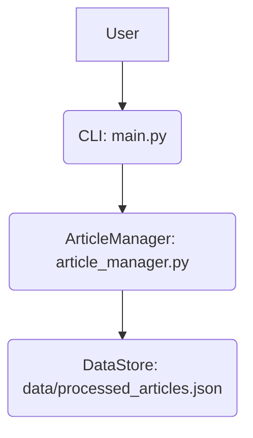
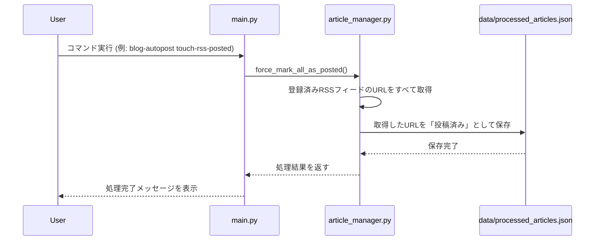

# Technical Design Document

## Overview
**Purpose**: 本機能は、登録されたRSSフィードのアイテムを強制的に「すべて投稿済み」の状態に設定する機能を提供します。これにより、何らかの理由でシステムの状態がリセットされた場合でも、過去のアイテムが意図せず再投稿されることを防ぎ、システムの安全性を確保します。
**Users**: システム管理者、またはデータリセット後にシステムの整合性を確保したいユーザーが本機能を利用します。
**Impact**: 既存のRSSフィード管理機能に新しい操作を追加し、システムの堅牢性を向上させます。

### Goals
- ユーザーがコマンドラインからRSSフィードのアイテムを「すべて投稿済み」としてマークできること。
- `data` ディレクトリがリセットされた場合でも、過去のアイテムが意図せず再投稿されないようにすること。
- 処理結果をユーザーに通知すること。

### Non-Goals
- 個別のRSSフィードアイテムの状態を操作する機能。
- 投稿済み状態を元に戻す機能。

## Architecture

### Existing Architecture Analysis
- `article_manager.py`: RSS/Atomフィードの取得、新着記事の判定、処理済み記事の永続化（JSON形式）を担当しています。
- `main.py`: CLIのエントリーポイントであり、コマンドライン引数の解析と各機能への処理の振り分けを行います。

### High-Level Architecture
本機能は、既存のCLIツールに新しいサブコマンドを追加することで実現されます。このサブコマンドは `main.py` によって解析され、`article_manager.py` 内に新設されるメソッドを呼び出します。`article_manager.py` の新しいメソッドは、既存の投稿済み記事を管理するJSONファイルを更新し、登録されているすべてのRSSフィードアイテムを「投稿済み」として記録します。



**Architecture Integration**:
- Existing patterns preserved: CLIベースの操作、プラグインアーキテクチャ、JSONファイルによるデータ永続化といった既存のパターンを維持します。
- New components rationale: 新しいサブコマンドと `article_manager.py` 内のメソッドは、ユーザーの要求に応じた強制既読化機能を提供するために必要です。
- Technology alignment: 既存のPython、`uv`、`feedparser`、JSONファイルでの永続化といった技術スタックに完全に準拠します。
- Steering compliance: プロジェクト構造 (`structure.md`) および技術スタック (`tech.md`) に沿った拡張であり、プロダクトの価値提案 (`product.md`) である「堅牢性」と「柔軟な投稿管理」に貢献します。

### Technology Stack and Design Decisions

**Technology Alignment**:
- 本機能は、既存のPython、`uv`、`feedparser`、JSONファイルでの永続化といった技術スタックに完全に準拠します。
- 新しい外部ライブラリの導入は不要です。

**Key Design Decisions**:
- **Decision**: 新しいCLIサブコマンドの導入。
    - **Context**: ユーザーが手動でRSSフィードの強制既読化を実行できるようにするため。
    - **Alternatives**: 設定ファイルによる自動既読化、Web UIからの操作。
    - **Selected Approach**: CLIサブコマンド。既存のCLIツールに統合しやすく、シンプルに機能を提供できます。
    - **Rationale**: 既存のCLIベースの運用に合致し、開発コストが低いと判断しました。
    - **Trade-offs**: Web UIのような直感的な操作性はありません。
- **Decision**: `article_manager.py` 内での投稿済み状態の管理方法。
    - **Context**: 既存の投稿済み記事の永続化メカニズムを再利用し、データの一貫性を保つため。
    - **Alternatives**: 新しいデータベースやファイル形式の導入。
    - **Selected Approach**: 既存のJSONファイル形式 (`data/processed_articles.json`) を拡張し、すべてのRSSフィードアイテムのURLを「投稿済み」として記録します。
    - **Rationale**: 既存のデータ管理ロジックを流用でき、シンプルかつ効率的です。
    - **Trade-offs**: 大量のRSSフィードアイテムがある場合、JSONファイルのサイズが大きくなる可能性がありますが、現在のプロジェクト規模では許容範囲と判断します。

## System Flows

### Sequence Diagram: RSSフィード強制既読化コマンド実行


## Components and Interfaces

### Article Management

#### `article_manager.py`

**Responsibility & Boundaries**
- **Primary Responsibility**: RSS/Atomフィードの取得、新着記事の判定、処理済み記事の永続化、および本機能におけるRSSフィードアイテムの強制既読化。
- **Domain Boundary**: 記事の管理と状態追跡。
- **Data Ownership**: `data/processed_articles.json` ファイル。

**Dependencies**
- **Inbound**: `main.py` (新しいCLIサブコマンド経由)
- **Outbound**: `feedparser` (RSSフィード取得), ファイルシステム (JSONファイルの読み書き)

**Contract Definition**

**Service Interface**
```python
class ArticleManager:
    # ... 既存のメソッド ...

    def force_mark_all_as_posted(self) -> dict:
        """
        登録されているすべてのRSSフィードのアイテムを「投稿済み」としてマークします。

        Returns:
            dict: 処理結果を示す辞書。成功/失敗、処理されたアイテム数など。
        """
        pass
```
- **Preconditions**: `config.yml` にRSSフィードが登録されていること。
- **Postconditions**: 登録されたすべてのRSSフィードのアイテムが `data/processed_articles.json` に「投稿済み」として記録されること。
- **Invariants**: `data/processed_articles.json` の形式が維持されること。

## Data Models

### Physical Data Model

#### `data/processed_articles.json`

- 既存のJSONファイル形式を拡張し、強制既読化されたアイテムのURLを追記します。
- 構造例:
    ```json
    {
      "https://example.com/feed1": [
        "https://example.com/feed1/article1",
        "https://example.com/feed1/article2"
      ],
      "https://example.com/feed2": [
        "https://example.com/feed2/articleA",
        "https://example.com/feed2/articleB",
        "https://example.com/feed2/articleC"
      ],
      "__forced_posted_urls__": [
        "https://example.com/feed1/article1",
        "https://example.com/feed1/article2",
        "https://example.com/feed2/articleA",
        "https://example.com/feed2/articleB",
        "https://example.com/feed2/articleC"
        // ... 強制既読化されたすべてのURL ...
      ]
    }
    ```
    - `__forced_posted_urls__` という新しいキーを追加し、強制既読化されたすべてのURLをリストとして保持します。これにより、既存のフィードごとの管理と分離しつつ、一元的に管理できます。
    - `article_manager` は、新しい記事を検出する際に、この `__forced_posted_urls__` リストも参照し、リストに含まれるURLは投稿対象から除外します。

## Error Handling

### Error Strategy
- **ファイルI/Oエラー**: JSONファイルの読み書きに失敗した場合、適切なエラーメッセージをログに出力し、ユーザーに通知します。
- **RSSフィード取得エラー**: 登録されているRSSフィードの取得に失敗した場合、そのフィードはスキップし、エラーメッセージをログに出力します。

### Error Categories and Responses
- **システムエラー**: ファイルシステムへのアクセス失敗など。ユーザーには処理が失敗した旨を伝え、ログを確認するよう促します。
- **ビジネスロジックエラー**: 登録されているRSSフィードがない場合など。ユーザーにはその旨を伝え、設定を確認するよう促します。

## Testing Strategy

- **ユニットテスト**:
    - `article_manager.py` の `force_mark_all_as_posted` メソッドが正しくJSONファイルを更新すること。
    - `article_manager.py` が `__forced_posted_urls__` に含まれるURLを投稿対象から除外すること。
- **結合テスト**:
    - 新しいCLIサブコマンドが正しく `force_mark_all_as_posted` メソッドを呼び出し、期待される結果を返すこと。
    - `--dry-run` オプションと組み合わせて、実際にファイルが変更されないことを確認すること。