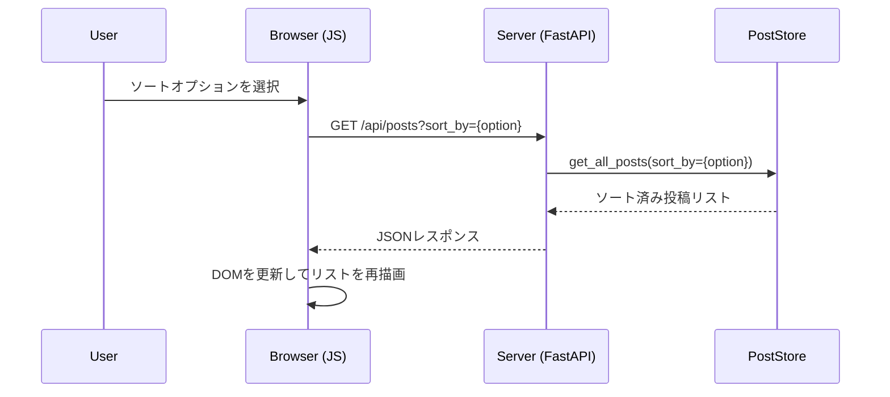
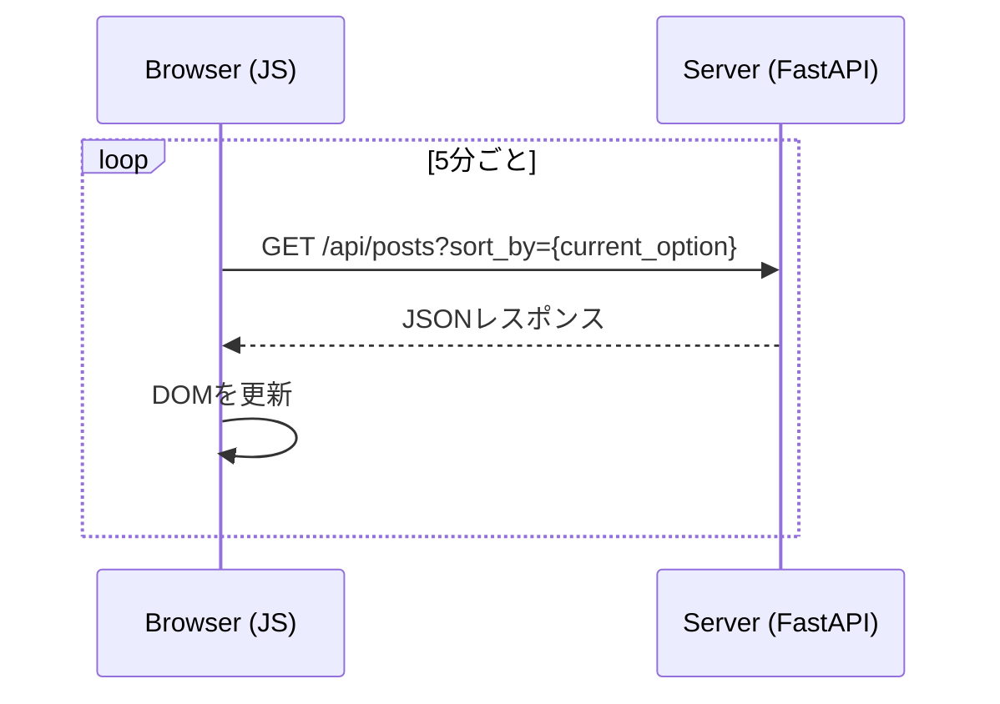

# 技術設計書: 予約投稿機能の拡張

## 1. 概要

**目的**: この機能拡張は、予約投稿管理UIのユーザー体験を向上させることを目的とします。具体的には、投稿リストのソート機能、表示データの整合性確保、UIの自動更新機能を提供します。

**ユーザー**: コンテンツ管理者やブロガーが、予約投稿の管理をより効率的に行うために本機能を利用します。

**インパクト**: この変更により、既存の予約投稿一覧表示機能が拡張されます。ユーザーは投稿を様々な条件で並べ替えられるようになり、手動でリロードすることなく最新の状態を把握できるようになります。

### ゴール

- 予約投稿リストを「投稿予定日」「ステータス」でソートできる機能を提供する。
- UIに表示される予約投稿が、データストアの現在の状態と常に一致するようにする。
- 定期的に投稿リストを自動更新し、最新のステータスをSPA（Single Page Application）的に表示する。

### ノンゴール

- リアルタイムでの共同編集機能。
- 複雑なフィルタリング機能（キーワード検索など）。
- 本設計の範囲外での大幅なUIデザインの変更。

## 2. アーキテクチャ

### 既存アーキテクチャの分析

現在のWebアプリケーションは、バックエンドにFastAPI、フロントエンドにJinja2テンプレートとVanilla JavaScriptを使用した、比較的シンプルな構成です。

- **`main_web.py`**: FastAPIアプリケーションのエントリーポイント。APIエンドポイントの定義とリクエストの処理を担当。
- **`scheduler_service.py`**: 投稿のスケジューリングと実行を管理するバックグラウンドサービス。
- **`scheduled_post_store.py`**: `scheduled_posts.json`ファイルへの予約投稿データの読み書きを行うデータストア層。
- **`templates/index.html`**: 予約投稿の作成と一覧表示を行う単一のHTMLページ。

### 高レベルアーキテクチャ

今回の機能拡張は、既存のアーキテクチャパターンを維持しつつ、フロントエンドとバックエンド間の連携を強化します。主な変更は、APIの拡張とフロントエンドのJavaScriptロジックの追加です。

```mermaid
graph TD
    subgraph Browser
        A[index.html] -- 1. Select Sort / Timer Event --> B(JavaScript);
        B -- "2. Fetch API with sort param" --> C[/api/posts?sort_by=...];
        C -- "6. Receive JSON" --> B;
        B -- 7. Update DOM --> A;
    end

    subgraph Server (FastAPI)
        C -- 3. Request --> D[main_web.py];
        D -- "4. Get sorted posts" --> E[scheduled_post_store.py];
        E -- "5. Read & Sort data" --> D;
        D -- "Return JSON" --> C;
    end

    E -- Reads/Writes --> F[scheduled_posts.json];
```

### 技術スタックと設計判断

本機能は既存の技術スタック（FastAPI, Jinja2, Vanilla JS）を踏襲します。新しい外部ライブラリの導入は不要です。

**主要な設計判断**:
- **決定**: UIの更新には、WebSocketやSSEではなく、フロントエンドからの定期的なAPIポーリング方式を採用する。
- **コンテキスト**: 要件で「SPA的挙動、優先度低め」とされており、リアルタイム性は厳しく求められていないため。
- **代替案**:
    1.  WebSocket: サーバーからのプッシュ通知が可能でリアルタイム性に優れるが、実装が複雑になる。
    2.  Server-Sent Events (SSE): サーバーからクライアントへの一方向通信。WebSocketよりシンプルだが、今回の要件には過剰。
- **選択したアプローチ**: JavaScriptの`setInterval`を使用して、5分ごとに`/api/posts`エンドポイントにリクエストを送信する。
- **合理性**: 実装が容易であり、サーバーへの負荷も許容範囲内。要件をシンプルに満たすことができる。
- **トレードオフ**: リアルタイム性は犠牲になるが、実装コストと複雑さを大幅に低減できる。

## 3. システムフロー

### ソート機能のフロー



### 自動更新フロー



## 4. コンポーネントとインターフェース

### `main_web.py` (FastAPI)

#### 責任と境界
- Webリクエストの受付と、適切なサービスへの処理の委譲。
- 認証と認可の強制。

#### 契約定義
- **修正**: `GET /`
    - `sort_by` (Optional[str]) クエリパラメータを追加。指定された場合、ソート済みの投稿リストを含むHTMLを返す。
- **新規**: `GET /api/posts`
    - `sort_by` (Optional[str]) クエリパラメータを受け付ける。
    - **レスポンス**: `List[ScheduledPost]` モデルに基づいたJSON配列を返す。
    ```json
    [
      {
        "id": "...", "scheduled_at": "...", "content": "...", 
        "status": "...", ...
      }
    ]
    ```

### `scheduled_post_store.py`

#### 責任と境界
- `scheduled_posts.json`の読み書きと、データモデルへの変換。
- 投稿データの永続化と取得に関するロジックを担当。

#### 契約定義
- **修正**: `get_all_posts()`
    - `sort_by: Optional[str] = None` パラメータを追加。
    - `sort_by` の値に応じて、返す投稿リストをソートするロジックを実装する。
        - `date_asc` (default): `scheduled_at` 昇順
        - `date_desc`: `scheduled_at` 降順
        - `status_failed`: `status` が "失敗" のものを優先
        - `status_completed`: `status` が "実行済み" のものを優先
    - **クリーンアップ要件**: このメソッドは常にファイルから最新のデータを読み込むため、ファイルから削除された投稿は自動的に返されなくなり、要件を満たす。

### `templates/index.html`

#### 責任と境界
- ユーザーインターフェースの提供。
- ユーザー操作のハンドリングと、バックエンドAPIとの非同期通信。

#### 契約定義
- **UI変更**:
    - 予約投稿一覧の上に、ソート順を選択するための`<select>`ドロップダウンを追加する。
- **JavaScriptロジック**:
    - **`fetchAndRenderPosts(sortBy)`**: 指定されたソート順で`/api/posts`を叩き、返されたJSONで投稿一覧テーブルのDOMを再構築する関数。
    - **イベントリスナー**: ソート用ドロップダウンの`change`イベントを監視し、`fetchAndRenderPosts`を呼び出す。
    - **`setInterval`**: ページ読み込み時にタイマーをセットし、5分ごとに`fetchAndRenderPosts`を現在のソート順で呼び出す。

## 5. データモデル

### APIコントラクト: `GET /api/posts`

- **リクエスト**:
    - クエリパラメータ: `sort_by: str` (任意)。値: `date_asc`, `date_desc`, `status_failed`, `status_completed`
- **レスポンス**: `application/json`
    - `ScheduledPost`モデルの配列。`scheduled_post_model.py`の定義に従う。

## 6. エラーハンドリング

- フロントエンドのJavaScriptは、`fetch` API呼び出し時に`try...catch`ブロックを使用し、ネットワークエラーやサーバーエラー（5xx）をハンドリングする。エラー発生時は、UI上に目立たない形で小さなエラーメッセージを表示する（例: 「リストの更新に失敗しました」）。

## 7. テスト戦略

- **単体テスト**:
    - `scheduled_post_store.py`の`get_all_posts`メソッドについて、各ソートオプションが正しく機能することを検証するテストケースを追加する。
- **結合テスト**:
    - FastAPIの`TestClient`を使用し、`/api/posts`エンドポイントが`sort_by`パラメータに応じて正しいJSONを返すことをテストする。
    - ルートエンドポイント`/`が`sort_by`パラメータに応じて正しくソートされたHTMLを返すことをテストする。
- **E2Eテスト**:
    - （手動）ブラウザで`index.html`を開き、ソートドロップダウンが機能することを確認する。
    - （手動）投稿データを手動で変更した後、ページが5分以内に自動更新されることを確認する。
