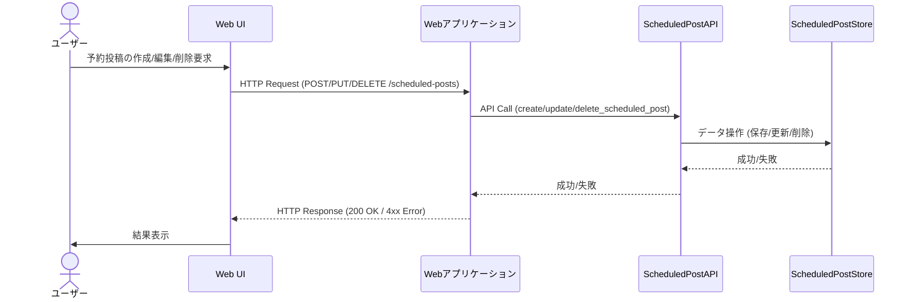
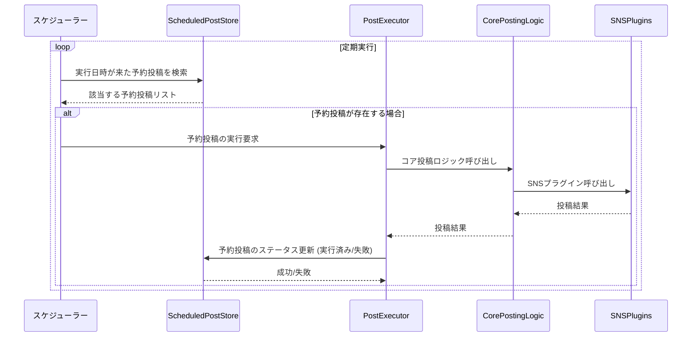

# Technical Design Document

## Overview 
**Purpose**: この機能は、ユーザーがWeb UIを通じて予約投稿を効率的に管理できるようにします。具体的には、予約投稿の一覧表示、詳細の編集、不要な予約の取り消し、失敗した予約の再実行、および予約投稿の即時実行を可能にすることで、ユーザーは投稿スケジュールを柔軟に制御し、コンテンツ配信の信頼性を向上させます。また、予約時間を過ぎても送信されていない失敗した投稿を視覚的に強調表示することで、ユーザーは問題のある投稿を迅速に特定し、対処できます。
**Users**: コンテンツクリエイター、ブロガー、メディア運営者など、定期的な情報発信を行うユーザーが対象です。
**Impact**: 現在のCLIベースの投稿管理にWeb UIによる予約投稿管理機能を追加し、より直感的で柔軟な投稿運用を可能にします。


### Goals
- 予約投稿の一覧をWeb UIで表示できる。
- 既存の予約投稿の内容（テキスト、URL、メディア、対象SNS）および投稿日時をWeb UIで編集できる。
- 不要な予約投稿をWeb UIから取り消せる。
- 失敗した予約投稿をWeb UIから再実行できる。
- 予約済みの投稿をWeb UIから即座に送信できる。
- 予約時間を過ぎて失敗した投稿をWeb UI上で強調表示できる。

### Non-Goals
- 予約投稿の高度な分析レポート機能。
- 予約投稿のドラフト機能（下書き保存）。
- 複数ユーザーによる予約投稿の共同編集機能。

## Architecture

### Existing Architecture Analysis
既存のシステムはPythonベースのCLIツールであり、`src/main.py`がエントリーポイントとなっています。SNSへの投稿はプラグインアーキテクチャ (`src/plugins/`) を採用し、メディア処理 (`media_validator.py`, `media_converter.py`, `image_resizer.py`) やテキスト最適化 (`text_optimizer.py`, `url_shortener.py`) のモジュールが提供されています。Web関連のファイル (`src/web/auth_service.py`, `src/web/main_web.py`, `src/web/posting_service.py`) が存在しますが、その具体的なフレームワークや実装詳細は不明です。認証機能は `auth_service.py` で提供されていると想定します。

### High-Level Architecture
```mermaid
graph TD
    User[ユーザー (Web UI)] --> |HTTP Request| WebApp[Webアプリケーション (src/web/main_web.py)]
    WebApp --> |認証| AuthService[認証サービス (src/web/auth_service.py)]
    WebApp --> |API Call| ScheduledPostAPI[予約投稿API (新規)]
    ScheduledPostAPI --> |データ操作| ScheduledPostStore[予約投稿データストア (新規)]
    ScheduledPostAPI --> |投稿実行要求| PostExecutor[投稿実行サービス (新規)]
    PostExecutor --> |投稿処理| CorePostingLogic[コア投稿ロジック (src/main.pyのラップ)]
    CorePostingLogic --> |プラグイン呼び出し| SNSPlugins[SNSプラグイン (src/plugins/)]
    CorePostingLogic --> |メディア処理| MediaServices[メディア処理 (image_resizer.py, media_validator.py)]
    CorePostingLogic --> |テキスト最適化| TextOptimizer[テキスト最適化 (text_optimizer.py, url_shortener.py)]
    ScheduledPostStore --> |定期監視| Scheduler[スケジューラー (新規バックグラウンドプロセス)]
    Scheduler --> |投稿実行要求| PostExecutor
```

**Architecture Integration**:
- **既存パターン維持**: SNSプラグインアーキテクチャ、メディア処理、テキスト最適化の既存モジュールを再利用し、CLIツールとしてのコア投稿ロジックをWeb APIから呼び出せるようにラップします。
- **新規コンポーネントの根拠**:
    - `ScheduledPostAPI`: Web UIからの予約投稿管理要求を処理するためのRESTful APIエンドポイントを提供します。
    - `ScheduledPostStore`: 予約投稿データを永続化し、CRUD操作を提供します。
    - `PostExecutor`: 予約投稿の実行要求を受け付け、コア投稿ロジックを呼び出す役割を担います。
    - `Scheduler`: 予約投稿日時を監視し、時間になった投稿を `PostExecutor` に渡すバックグラウンドプロセスです。
- **技術アラインメント**: Pythonベースの既存スタックに準拠し、Webフレームワークは既存の `src/web/main_web.py` に合わせて拡張します。
- **ステアリングコンプライアンス**: `structure.md` の「責任の分離」「プラグインアーキテクチャ」の原則を維持し、`product.md` の「柔軟な投稿管理」の価値提案を実現します。

### Technology Stack and Design Decisions

**Technology Alignment**:
本機能は既存のPythonベースの技術スタックに準拠します。
- **Webフレームワーク**: 既存の `src/web/main_web.py` が使用しているフレームワーク（例: Flask, FastAPI）を拡張します。
- **予約投稿データストア**: 既存の `article_manager.py` がJSONファイルで記事情報を永続化しているパターンに倣い、`data/scheduled_posts.json` のようなJSONファイルで予約投稿データを管理します。
- **スケジューリング**: バックグラウンドでの定期実行には `APScheduler` などのPython製スケジューリングライブラリを導入します。
- **新規ライブラリ**: `APScheduler` (スケジューリング用)

**Key Design Decisions**:

- **Decision**: 予約投稿データの永続化にJSONファイルを採用する。
    - **Context**: 既存の `article_manager.py` がJSONファイルで記事情報を永続化しているため、一貫性を保ち、軽量なデータ管理を実現するため。
    - **Alternatives**: SQLiteなどの軽量RDBMS。
    - **Selected Approach**: `data/scheduled_posts.json` ファイルに予約投稿のリストをJSON形式で保存する。各予約投稿は一意のIDを持ち、投稿内容、日時、対象SNS、メディア情報、ステータス（予約済み、実行済み、失敗など）を保持する。
    - **Rationale**: 既存のデータ永続化パターンとの整合性が高く、追加のデータベース設定が不要で、開発・デプロイが容易。
    - **Trade-offs**: 大量の予約投稿データに対するクエリ性能はRDBMSに劣る可能性があるが、本機能の想定規模では問題ないと判断。データ整合性の担保はアプリケーションロジックで厳密に行う必要がある。

- **Decision**: 予約投稿の実行にバックグラウンドスケジューラー (`APScheduler`) を導入する。
    - **Context**: 予約投稿は指定された時間に自動的に実行される必要があり、Webアプリケーションのメインプロセスとは独立して動作する永続的なプロセスが必要なため。
    - **Alternatives**: Celery (より大規模な分散タスクキュー), cronジョブ (OSレベルのスケジューリング)。
    - **Selected Approach**: `APScheduler` を利用し、Webアプリケーションとは別のプロセスとして起動するスケジューラーサービスを構築する。このサービスは定期的に `ScheduledPostStore` を監視し、実行日時が来た予約投稿を `PostExecutor` に渡す。
    - **Rationale**: Pythonネイティブで軽量であり、本プロジェクトの規模に適している。Webアプリケーションと疎結合にタスク実行を管理できる。
    - **Trade-offs**: 別のプロセス管理が必要になる。スケジューラープロセスの信頼性（クラッシュ時の復旧など）を考慮する必要がある。

## System Flows

### 予約投稿の作成・編集・削除フロー


### 予約投稿の実行フロー


## Components and Interfaces

### Webアプリケーション (`src/web/main_web.py` 拡張)

#### `ScheduledPostAPI` (新規)

**Responsibility & Boundaries**
- **Primary Responsibility**: 予約投稿のCRUD操作および実行・即時送信要求を受け付けるRESTful APIエンドポイントを提供します。
- **Domain Boundary**: 予約投稿管理ドメインに属します。
- **Data Ownership**: 予約投稿データストアへのアクセスを抽象化します。
- **Transaction Boundary**: 各APIリクエスト内で予約投稿データの整合性を保ちます。

**Dependencies**
- **Inbound**: Web UI
- **Outbound**: `ScheduledPostStore`, `PostExecutor`, `AuthService`
- **External**: なし

**Contract Definition**

**API Contract**:
| Method | Endpoint | Request Body | Response Body | Errors |
|--------|----------|--------------|---------------|--------|
| GET    | `/scheduled-posts` | なし | `List<ScheduledPost>` | 401 (Unauthorized) |
| GET    | `/scheduled-posts/{id}` | なし | `ScheduledPost` | 401, 404 (Not Found) |
| POST   | `/scheduled-posts` | `ScheduledPostCreateRequest` | `ScheduledPost` | 400 (Bad Request), 401 |
| PUT    | `/scheduled-posts/{id}` | `ScheduledPostUpdateRequest` | `ScheduledPost` | 400, 401, 404 |
| DELETE | `/scheduled-posts/{id}` | なし | `{"message": "Success"}` | 401, 404, 409 (Conflict - 実行済みの場合) |
| POST   | `/scheduled-posts/{id}/re-execute` | なし | `ScheduledPost` | 401, 404, 409 (Conflict - 成功済みの場合) |
| POST   | `/scheduled-posts/{id}/send-now` | なし | `ScheduledPost` | 401, 404, 409 (Conflict - 実行済みの場合) |

**データモデル (Request/Response)**:
- `ScheduledPost`:
    - `id`: string (UUID)
    - `scheduled_at`: datetime (ISO 8601)
    - `content`: string (投稿テキスト)
    - `media_files`: List<string> (メディアファイルのパス)
    - `target_sns`: List<string> (対象SNSのリスト)
    - `status`: string (予約済み, 実行済み, 失敗)
    - `error_message`: string (失敗時のエラーメッセージ)
- `ScheduledPostCreateRequest`: `scheduled_at`, `content`, `media_files`, `target_sns`
- `ScheduledPostUpdateRequest`: `scheduled_at`, `content`, `media_files`, `target_sns` (全てOptional)

#### `ScheduledPostStore` (新規)

**Responsibility & Boundaries**
- **Primary Responsibility**: 予約投稿データの永続化と、CRUD操作を提供します。
- **Domain Boundary**: 予約投稿管理ドメインに属します。
- **Data Ownership**: 予約投稿データそのものを所有します。
- **Transaction Boundary**: JSONファイルへの書き込み操作の原子性を保証します。

**Dependencies**
- **Inbound**: `ScheduledPostAPI`, `Scheduler`, `PostExecutor`
- **Outbound**: なし
- **External**: ファイルシステム

**Contract Definition**

**Service Interface**:
```python
class ScheduledPostStore:
    def get_all_posts(self) -> List[ScheduledPost]: ...
    def get_post_by_id(self, post_id: str) -> Optional[ScheduledPost]: ...
    def create_post(self, post: ScheduledPost) -> ScheduledPost: ...
    def update_post(self, post_id: str, updates: Dict) -> ScheduledPost: ...
    def delete_post(self, post_id: str): ...
```
- **Preconditions**:
    - `create_post`: `post` オブジェクトが有効なデータを持つこと。
    - `update_post`: `post_id` が存在し、`updates` が有効なデータを持つこと。
    - `delete_post`: `post_id` が存在すること。
- **Postconditions**:
    - `create_post`: 新しい予約投稿がデータストアに保存され、返される。
    - `update_post`: 指定された予約投稿が更新され、返される。
    - `delete_post`: 指定された予約投稿がデータストアから削除される。
- **Invariants**: 予約投稿は一意のIDを持つ。

#### `PostExecutor` (新規)

**Responsibility & Boundaries**
- **Primary Responsibility**: 予約投稿の実行要求を受け付け、既存のコア投稿ロジックを呼び出して投稿を実行します。
- **Domain Boundary**: 投稿実行ドメインに属します。
- **Data Ownership**: 投稿実行に関する一時的な状態を管理します。
- **Transaction Boundary**: 投稿実行処理の原子性を保証します。

**Dependencies**
- **Inbound**: `ScheduledPostAPI`, `Scheduler`
- **Outbound**: `CorePostingLogic` (既存の `main.py` の投稿処理をラップしたもの), `ScheduledPostStore`
- **External**: なし

**Contract Definition**

**Service Interface**:
```python
class PostExecutor:
    def execute_post(self, post_id: str) -> bool: ... # True: 成功, False: 失敗
```
- **Preconditions**: `post_id` が存在し、対応する予約投稿が有効な状態であること。
- **Postconditions**: 投稿が試行され、`ScheduledPostStore` のステータスが更新される。
- **Invariants**: なし

#### `Scheduler` (新規バックグラウンドプロセス)

**Responsibility & Boundaries**
- **Primary Responsibility**: 定期的に `ScheduledPostStore` を監視し、実行日時が来た予約投稿を `PostExecutor` に渡します。
- **Domain Boundary**: スケジューリングドメインに属します。
- **Data Ownership**: なし
- **Transaction Boundary**: なし

**Dependencies**
- **Inbound**: なし (自己起動)
- **Outbound**: `ScheduledPostStore`, `PostExecutor`
- **External**: なし

**Contract Definition**

**Batch/Job Contract**:
- **Trigger**: `APScheduler` により、例えば1分ごとに定期実行。
- **Input**: `ScheduledPostStore` から取得する予約投稿データ。
- **Output**: `PostExecutor` への実行要求、`ScheduledPostStore` へのステータス更新要求。
- **Idempotency**: 既に実行された投稿は再度実行しないように `status` フィールドで管理。
- **Recovery**: スケジューラープロセスが停止した場合、再起動時に未実行の過去の予約投稿を検出し、実行を試みる。

## Data Models

### Domain Model: `ScheduledPost`

**Core Concepts**:
- **Entity**: `ScheduledPost`
    - `id`: UUID (一意の識別子)
    - `scheduled_at`: datetime (投稿予定日時)
    - `content`: string (投稿テキスト)
    - `media_files`: List<string> (添付メディアファイルのパスリスト)
    - `target_sns`: List<string> (投稿対象SNSのリスト)
    - `status`: string (予約済み, 実行済み, 失敗)
    - `error_message`: string (投稿失敗時のエラー詳細)
    - `created_at`: datetime (予約作成日時)
    - `updated_at`: datetime (最終更新日時)

**Business Rules & Invariants**:
- `scheduled_at` は常に未来の日時であるか、過去の場合は `status` が「実行済み」または「失敗」であること。
- `status` が「実行済み」または「失敗」の投稿は編集・取り消し・即時送信ができない。
- `media_files` に含まれるパスは、システムがアクセス可能な有効なファイルパスであること。
- `target_sns` に含まれるSNSは、システムがサポートするSNSであること。

### Physical Data Model: JSON File (`data/scheduled_posts.json`)

**For Document Stores (JSON)**:
- **Collection Structures**: ルート要素は `ScheduledPost` オブジェクトの配列。
- **Embedding vs Referencing Decisions**: `ScheduledPost` オブジェクトは自己完結型で、他のエンティティへの参照は含まない。
- **Index Definitions**: なし (ファイル全体を読み込み、メモリ上で検索・フィルタリングを行う)。

```json
[
  {
    "id": "uuid-1",
    "scheduled_at": "2025-10-02T10:00:00Z",
    "content": "今日のブログ記事を予約投稿します。",
    "media_files": ["/path/to/image1.jpg"],
    "target_sns": ["x", "bluesky"],
    "status": "予約済み",
    "error_message": null,
    "created_at": "2025-10-01T09:00:00Z",
    "updated_at": "2025-10-01T09:00:00Z"
  },
  {
    "id": "uuid-2",
    "scheduled_at": "2025-09-30T15:00:00Z",
    "content": "昨日のブログ記事の予約投稿が失敗しました。",
    "media_files": [],
    "target_sns": ["mastodon"],
    "status": "失敗",
    "error_message": "SNS接続エラー: タイムアウト",
    "created_at": "2025-09-29T14:00:00Z",
    "updated_at": "2025-09-30T15:05:00Z"
  }
]
```

## Error Handling

### Error Strategy
Web APIからのエラーはHTTPステータスコードとJSON形式のエラーレスポンスで通知します。バックグラウンドのスケジューラープロセスでのエラーはログに出力し、予約投稿のステータスを「失敗」に更新します。

### Error Categories and Responses
- **ユーザーエラー (4xx)**:
    - `400 Bad Request`: リクエストボディの形式が不正、必須フィールドの欠落、SNS制限違反など。詳細なエラーメッセージをJSONで返す。
    - `401 Unauthorized`: 認証されていないユーザーからのリクエスト。
    - `404 Not Found`: 指定された予約投稿IDが見つからない場合。
    - `409 Conflict`: 既に実行済みの予約投稿を編集・削除しようとした場合、または成功済みの投稿を再実行しようとした場合。
- **システムエラー (5xx)**:
    - `500 Internal Server Error`: 予期せぬサーバー内部エラー。ログに詳細を出力し、一般的なエラーメッセージを返す。
- **ビジネスロジックエラー (予約投稿実行時)**:
    - SNSへの投稿失敗: `PostExecutor` が `CorePostingLogic` からエラーを受け取った場合、`ScheduledPost` の `status` を「失敗」に更新し、`error_message` に詳細を記録します。

### Monitoring
- Webアプリケーションのエラーは標準的なWebサーバーのログに出力します。
- スケジューラープロセスおよび `PostExecutor` の実行ログは、専用のログファイルに出力し、エラー発生時には詳細なスタックトレースを含めます。
- 予約投稿の「失敗」ステータスは、Web UIで強調表示されることでユーザーに通知されます。

## Testing Strategy

- **Unit Tests**:
    - `ScheduledPostStore` のCRUD操作のテスト。
    - `ScheduledPostAPI` の各エンドポイントの入力バリデーションとビジネスロジックのテスト。
    - `PostExecutor` が `CorePostingLogic` を正しく呼び出し、ステータスを更新するテスト。
    - `Scheduler` が正しいタイミングで投稿を検出し、`PostExecutor` を呼び出すテスト。
- **Integration Tests**:
    - Web UIから予約投稿を作成し、一覧表示、編集、削除できるか。
    - 予約投稿がスケジュール通りに実行されるか。
    - 失敗した予約投稿がWeb UIで強調表示され、再実行できるか。
    - 即時送信が正しく機能するか。
- **E2E/UI Tests**:
    - ユーザーがログイン後、予約投稿の一覧画面にアクセスし、各操作（作成、編集、削除、再実行、即時送信）が期待通りに動作するか。
    - 失敗した予約投稿が視覚的に強調表示されることを確認。

## Security Considerations
- **認証・認可**: 既存の `src/web/auth_service.py` を利用し、予約投稿APIへのアクセスは認証されたユーザーのみに限定します。
- **入力バリデーション**: Web UIからの入力は、バックエンドのAPIで厳密にバリデーションを行い、SQLインジェクションやXSSなどの脆弱性を防ぎます。特に投稿内容やメディアファイルパスは注意深く処理します。
- **データ保護**: 予約投稿データ (`scheduled_posts.json`) は、適切なファイルパーミッションを設定し、不正なアクセスから保護します。
- **メディアファイル**: アップロードされたメディアファイルは、安全な場所に保存し、直接アクセスできないようにします。
