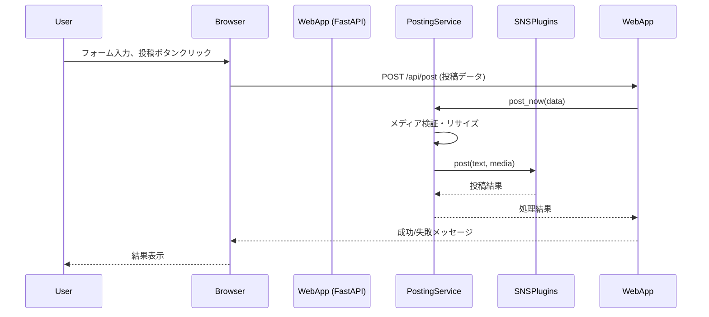
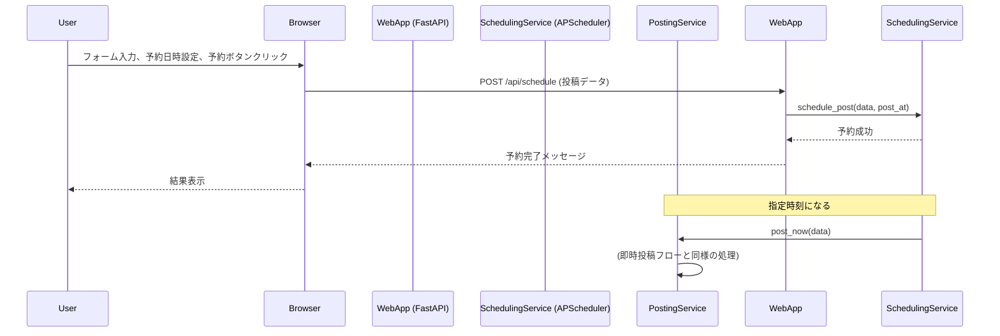

# 技術設計書: Web UIと送信機能

## Overview
**目的**: この機能は、既存の`blog-autopost` CLIツールに、ブラウザベースのUIを提供します。これにより、ユーザーは手動でのコンテンツ作成、メディアのアップロード、そして即時または予約投稿が可能になります。

**ユーザー**: このツールの唯一の管理者・利用者。

**インパクト**: 既存のRSS監視・自動投稿機能に加え、手動での柔軟な投稿手段を提供することで、ツールのユースケースを拡大します。CLIのコアロジックを再利用しつつ、Webインターフェースという新たなエントリーポイントを追加します。

### Goals
- 認証付きのWeb UIを提供する。
- テキスト、URL、複数画像のアップロードに対応した投稿作成フォームを実装する。
- 投稿前に文字数やメディア要件の事前検証を行う。
- 即時投稿および日時指定の予約投稿を可能にする。
- 既存のSNS投稿ロジック、メディア処理機能を再利用する。

### Non-Goals
- 複数ユーザー管理機能。認証は単一ユーザーを想定します。
- 投稿後の編集・削除機能。
- 投稿結果の分析や統計表示機能。

## Architecture

### Existing Architecture Analysis
本機能は既存のCLIアプリケーションに対する**拡張**です。以下の既存コンポーネントを最大限に再利用します。
- **`config_manager.py`**: SNSアカウント情報や各種設定の読み込み。
- **`plugin_loader.py`**: 各SNSプラグインの動的な読み込みと利用。
- **`media_validator.py`, `image_resizer.py`, `media_converter.py`**: 投稿メディアの検証、リサイズ、変換処理。
- **`text_optimizer.py`**: URL短縮を含むテキスト最適化処理。

### High-Level Architecture
Web UIレイヤーを新たに追加し、既存のビジネスロジック（サービスクラス群）をWebハンドラと共有します。

```mermaid
graph TD
    subgraph "Web Browser"
        A[ユーザー]
    end

    subgraph "Web Application (Python)"
        B[Webサーバー (Uvicorn)]
        C[Webフレームワーク (FastAPI)]
        D[認証サービス]
        E[投稿APIエンドポイント]
        F[予約投稿サービス (APScheduler)]
        G[SNS投稿サービス]
    end

    subgraph "既存コアモジュール"
        H[Config Manager]
        I[Plugin Loader]
        J[Media Processor]
        K[Text Optimizer]
    end

    subgraph "外部サービス"
        L[SNS Platforms <br>(X, Bluesky, etc.)]
    end

    A -- HTTP Request --> B
    B -- ASGI --> C
    C -- "/login" --> D
    C -- "/api/post" --> E
    E -- 投稿指示 --> G
    E -- 予約指示 --> F
    F -- 時間になったら実行 --> G
    G -- 投稿実行 --> I
    G -- メディア処理 --> J
    G -- テキスト最適化 --> K
    I -- 各SNSプラグイン --> L
    G -- 設定読み込み --> H
```

### Technology Stack and Design Decisions

#### Technology Alignment
既存のPythonベースのスタックに準拠し、以下のライブラリを新たに追加します。
- **Webフレームワーク**: `FastAPI` - 高速なパフォーマンス、Pydanticとの親和性、自動APIドキュメント生成機能が本プロジェクトに適しているため。
- **Webサーバー**: `Uvicorn` - FastAPIの標準的なASGIサーバー。
- **スケジューラ**: `APScheduler` - アプリケーションプロセス内で動作し、外部依存が少ないため、予約投稿機能の実現に最適。

#### Key Design Decisions
- **Decision**: フロントエンドはサーバーサイドレンダリング（SSR）を基本とし、JavaScriptは補助的に使用する。
- **Context**: プロジェクトの主軸はPythonであり、複雑なフロントエンド開発を避けるため。画像のドラッグ＆ドロップなど、UXを向上させる部分に限定してJavaScriptを利用します。
- **Alternatives**:
    1.  **React/Vue等のSPA**: 高機能だが、開発・ビルドの複雑性が増し、小規模な本UIには過剰。
    2.  **HTMX**: JavaScriptを記述せずにリッチなUIを実現できるが、学習コストとFastAPIとの連携パターンを新たに確立する必要がある。
- **Selected Approach**: FastAPIの`Jinja2Templates`を用いてHTMLをレンダリング。必要な箇所のみ、バニラJavaScriptで非同期通信やUI操作を実装します。
- **Rationale**: 既存のPythonスタックとの親和性が最も高く、開発速度とメンテナンス性を両立できます。
- **Trade-offs**: SPAのような高度で滑らかなUI体験は得られないが、機能要件をシンプルに満たすことができます。

## System Flows

### 即時投稿のシーケンス図


### 予約投稿のシーケンス図


## Components and Interfaces

### `web` (新規作成)
`src/web/`ディレクトリを新設し、Web関連のコンポーネントを配置します。

#### `WebServer` (main_web.py)
**Responsibility**: アプリケーションの起動、ルーティング、APIエンドポイントの定義。
**Dependencies**: FastAPI, Uvicorn, AuthService, PostingService, SchedulingService.

**API Contract**:
| Method | Endpoint | Request Body | Response | Description |
|--------|----------|--------------|----------|-------------|
| GET | / | - | HTML | ログインページまたは投稿フォームを表示 |
| POST | /login | `LoginRequest` | 200 OK / 401 Unauthorized | ユーザー認証 |
| POST | /api/post | `PostRequest` | 200 OK / 400 Bad Request | 即時投稿 |
| POST | /api/schedule | `PostRequest` | 202 Accepted / 400 Bad Request | 予約投稿 |

#### `AuthService`
**Responsibility**: ユーザー認証の処理。
**Dependencies**: `config_manager`.

**Service Interface**:
```python
class AuthService:
    def verify_credentials(self, request: LoginRequest) -> bool:
        # configからユーザー名・パスワードを取得し検証
```

#### `PostingService`
**Responsibility**: 投稿コンテンツの検証、最適化、および各SNSプラグインへのディスパッチ。
**Dependencies**: `plugin_loader`, `media_validator`, `image_resizer`, `text_optimizer`.

**Service Interface**:
```python
class PostingService:
    def post_now(self, post_data: PostRequest) -> PostResult:
        # メディア処理、テキスト最適化、プラグイン呼び出し
```

#### `SchedulingService`
**Responsibility**: 予約投稿のジョブ管理（追加、永続化）。
**Dependencies**: `APScheduler`, `PostingService`.

**Service Interface**:
```python
class SchedulingService:
    def schedule_post(self, post_data: PostRequest, post_at: datetime):
        # APSchedulerにPostingService.post_nowを呼び出すジョブを登録
```

## Data Models

### APIリクエストモデル (Pydantic)
```python
from pydantic import BaseModel
from typing import List, Optional

class LoginRequest(BaseModel):
    username: str
    password: str

class PostRequest(BaseModel):
    text: str
    url: Optional[str] = None
    media_files: List[str]  # アップロードされたファイルの一時パス
    sns_targets: List[str]  # 投稿対象のSNS名リスト
```

### 予約ジョブデータモデル
APSchedulerのジョブストアに保存されるデータ。
```json
{
  "job_id": "unique_id_for_the_job",
  "trigger": "date",
  "run_date": "iso_8601_timestamp",
  "func": "app.services.posting_service:post_now",
  "args": {
    "text": "投稿内容",
    "url": "http://example.com",
    "media_files": ["/tmp/path/to/file1.jpg"],
    "sns_targets": ["x", "bluesky"]
  }
}
```

## Error Handling
- **入力検証エラー (400 Bad Request)**: Pydanticモデルによるリクエストボディの検証。エラー詳細はJSONでフロントエンドに返す。
- **認証エラー (401 Unauthorized)**: `AuthService`での認証失敗時。ログインページにリダイレクトさせる。
- **SNS投稿エラー**: `PostingService`内で各プラグインからの例外を捕捉。どのSNSで、なぜ失敗したかを詳細に記録し、フロントエンドに返す。
- **予約ジョブ失敗**: `APScheduler`のリスナー機能でジョブの失敗を検知し、ログに記録する。

## Testing Strategy
- **Unit Tests**:
    - `AuthService`の認証ロジック。
    - `PostingService`が各サブモジュール（validator, resizer等）を正しく呼び出すかのテスト。
    - `SchedulingService`が正しくジョブを登録するかのテスト。
- **Integration Tests**:
    - FastAPIのTestClientを使用して、各APIエンドポイント（`/login`, `/api/post`, `/api/schedule`）が正しくリクエストを処理し、適切なレスポンスを返すかの統合テストを作成します。
- **E2E Tests**:
    - （手動）ブラウザからログインし、テキストと画像を投稿し、実際のSNSに投稿されるかを確認する。

## Security Considerations
- **認証**: ログイン情報は`config.yml`に記載し、安易なパスワードは避ける。総当たり攻撃を防ぐため、レートリミットの導入を検討する。
- **ファイルアップロード**: アップロードされるファイルのMIMEタイプを検証し、意図しないファイル（実行ファイルなど）のアップロードを拒否する。
- **アプリケーションの公開**: このWebアプリケーションは、ローカルネットワーク内での利用を前提とする。インターネットに公開する場合は、必ずNginxなどのリバースプロキシの背後に配置し、HTTPS化、IP制限などのセキュリティ対策を講じること。
