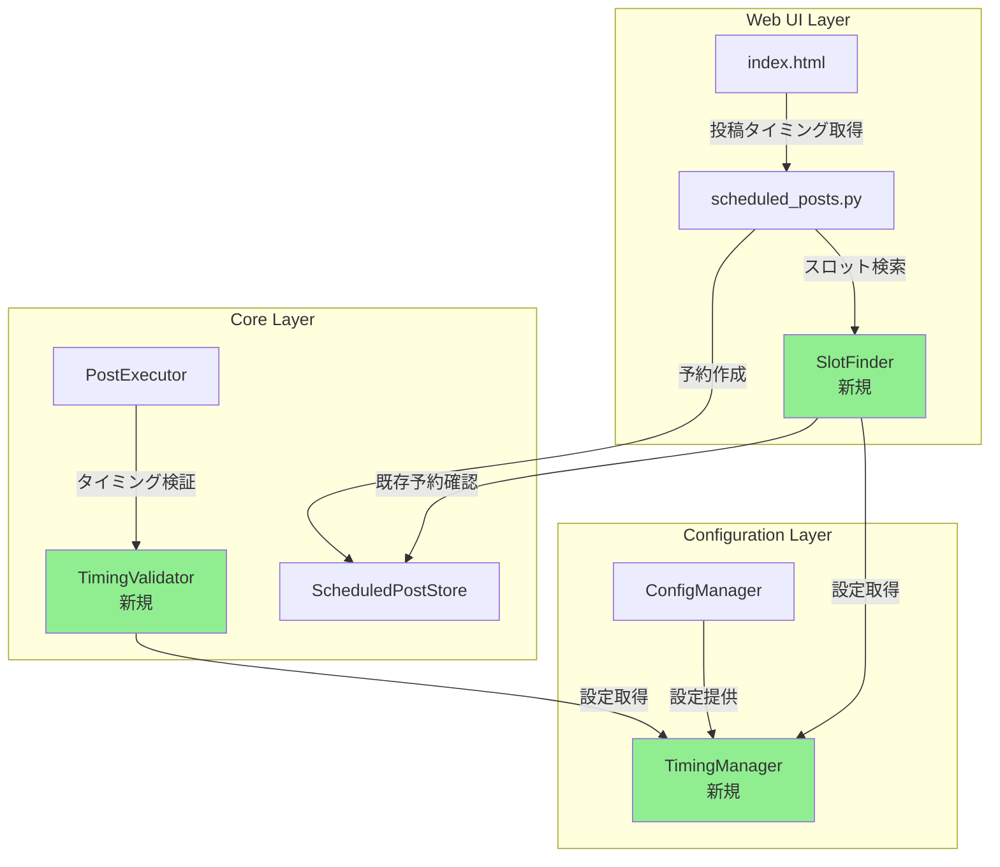
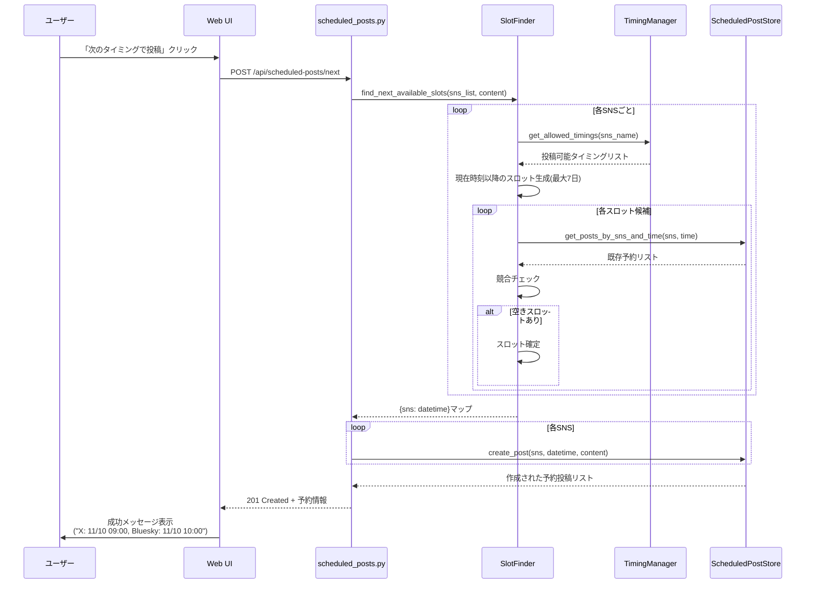
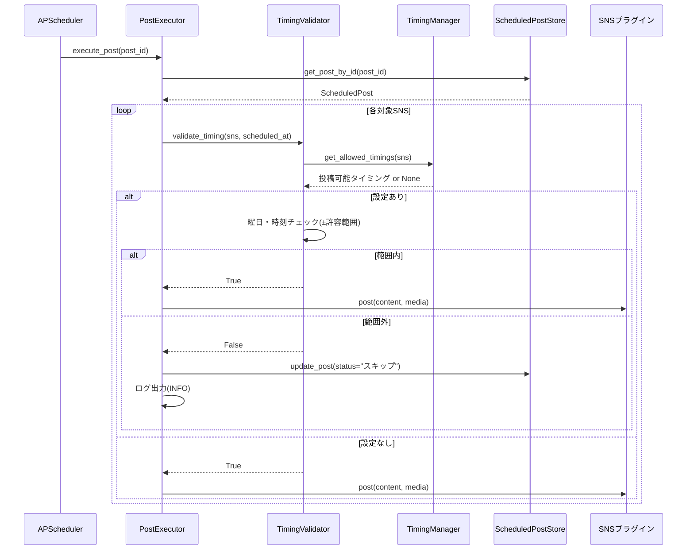

# Technical Design Document

## Overview

本設計では、既存の予約投稿機能を拡張し、Bufferスタイルの投稿タイミング管理システムを実装します。各SNSアカウントに曜日別・時刻別の投稿可能タイミングを設定し、「次の空きスロット」自動選択機能により、SNS運用の効率化と投稿タイミングの最適化を実現します。

### 主要な機能追加
1. 曜日別・時刻別投稿タイミング設定(グローバル + SNS固有)
2. 「次のタイミングで投稿」自動スロット選択機能
3. スロット競合管理
4. 手動時刻選択との併用サポート

## Architecture Changes

### Component Diagram



### Sequence Diagrams

#### 1. 次のタイミングで投稿フロー



#### 2. 予約投稿実行時のタイミング検証フロー



## Implementation Details

### Configuration Schema

#### config.ymlの拡張

```yaml
# グローバル投稿タイミング設定(全SNS共通)
default_allowed_timings:
  - ["*", ["18:00", "20:00"]]           # 全曜日の18:00と20:00
  - ["Weekday", ["09:00", "12:00"]]    # 平日の9:00と12:00
  - ["Weekend", ["10:00", "15:00"]]    # 週末の10:00と15:00

# 投稿タイミング設定の許容範囲(分単位、デフォルト: 5)
allowed_timings_tolerance_minutes: 5

sns:
  - type: x
    name: "x"
    # SNS固有の投稿タイミング設定
    allowed_timings:
      - ["Monday", ["09:00", "12:00", "15:00"]]
      - ["Wednesday", ["09:00", "15:30"]]
      - ["Friday", ["10:00", "14:00"]]
    # ... 既存の認証情報

  - type: bluesky
    name: "bluesky"
    # allowed_timingsなし = default_allowed_timingsのみ適用
    # ... 既存の認証情報
```

#### 設定の統合ルール

1. **SNS固有設定 + グローバル設定 = 利用可能スロット(和集合)**
2. **両方未設定 = 制限なし(従来通り)**
3. **ワイルドカード展開順序**: `*` > `Weekday`/`Weekend` > 特定曜日

### Data Models

#### 既存モデルの変更なし

`ScheduledPost`モデルは変更しません。後方互換性を維持します。

```python
@dataclass
class ScheduledPost:
    scheduled_at: datetime
    content: str
    id: str
    media_files: List[str]
    target_sns: List[str]
    status: str  # "予約済み", "実行済み", "失敗", "スキップ" ← 新ステータス追加
    error_message: Optional[str]
    created_at: datetime
    updated_at: datetime
```

### API Changes

#### 新規エンドポイント

**POST /api/scheduled-posts/next**

「次のタイミングで投稿」機能用の新規エンドポイント。

```python
# リクエスト
{
  "content": "投稿内容",
  "target_sns": ["x", "bluesky", "mastodon-social"],
  "media_files": ["base64encoded_data..."]  # オプション
}

# レスポンス (201 Created)
{
  "created_posts": [
    {
      "id": "uuid-1",
      "sns": "x",
      "scheduled_at": "2025-11-10T09:00:00+09:00",
      "status": "予約済み"
    },
    {
      "id": "uuid-2",
      "sns": "bluesky",
      "scheduled_at": "2025-11-10T10:00:00+09:00",
      "status": "予約済み"
    },
    {
      "id": "uuid-3",
      "sns": "mastodon-social",
      "scheduled_at": "2025-11-10T12:00:00+09:00",
      "status": "予約済み"
    }
  ],
  "errors": [
    {
      "sns": "misskey-io",
      "error": "7日以内に空きスロットが見つかりませんでした"
    }
  ]
}
```

#### 既存エンドポイントの変更

**POST /api/scheduled-posts**

手動時刻指定時のバリデーション強化。

```python
# リクエスト(変更なし)
{
  "scheduled_at": "2025-11-10T15:00:00+09:00",
  "content": "投稿内容",
  "target_sns": ["x"],
  "media_files": []
}

# レスポンス
# 時刻が許可範囲外の場合、400エラー
{
  "detail": {
    "type": "timing_violation",
    "message": "指定された時刻は投稿可能タイミングの範囲外です",
    "sns": "x",
    "requested_time": "2025-11-10T15:00:00+09:00",
    "allowed_timings": {
      "Monday": ["09:00", "12:00", "15:00"],
      "Wednesday": ["09:00", "15:30"]
    },
    "suggestion": "次の空きスロット: 2025-11-11T09:00:00+09:00"
  }
}
```

**GET /api/sns-timings**

新規エンドポイント: 各SNSの投稿可能タイミング情報を取得。

```python
# レスポンス
{
  "sns_timings": [
    {
      "sns_name": "x",
      "type": "x",
      "has_restrictions": true,
      "timings": {
        "Monday": [
          {"time": "09:00", "source": "固有"},
          {"time": "12:00", "source": "固有"},
          {"time": "18:00", "source": "共通"}
        ],
        "Tuesday": [
          {"time": "18:00", "source": "共通"}
        ]
      },
      "next_available_slot": "2025-11-10T09:00:00+09:00"
    },
    {
      "sns_name": "bluesky",
      "type": "bluesky",
      "has_restrictions": true,
      "timings": {
        "*": [
          {"time": "18:00", "source": "共通"},
          {"time": "20:00", "source": "共通"}
        ]
      },
      "next_available_slot": "2025-11-09T18:00:00+09:00"
    }
  ]
}
```

**DELETE /api/scheduled-posts/{post_id}**

予約投稿の取り消し(物理削除方式)。スロットを即座に解放します。

```python
# リクエスト
DELETE /api/scheduled-posts/abc-123-def

# レスポンス (200 OK)
{
  "message": "予約投稿を取り消しました",
  "post_id": "abc-123-def",
  "freed_slot": {
    "sns": "x",
    "scheduled_at": "2025-11-10T09:00:00+09:00"
  }
}

# レスポンス (404 Not Found)
{
  "detail": "Scheduled post not found"
}

# レスポンス (400 Bad Request - 既に実行済み)
{
  "detail": {
    "type": "already_executed",
    "message": "実行済みの投稿は取り消しできません",
    "status": "実行済み"
  }
}
```

### Core Components

#### Component 1: TimingManager

**Purpose:** 投稿可能タイミング設定の管理と提供

**Location:** `src/timing_manager.py` (新規)

**Responsibilities:**
- config.ymlから`default_allowed_timings`と各SNSの`allowed_timings`を読み込み
- ワイルドカード(`*`, `Weekday`, `Weekend`)の展開
- グローバル設定とSNS固有設定の統合(和集合)
- 曜日・時刻のバリデーション
- 統合済みタイミング情報のキャッシュ

**Key Methods/Functions:**

```python
class TimingManager:
    def __init__(self, config_manager: ConfigManager):
        """
        Args:
            config_manager: 設定マネージャー
        """

    def get_allowed_timings(self, sns_name: str) -> Optional[Dict[str, List[str]]]:
        """
        指定されたSNSの投稿可能タイミングを取得

        Args:
            sns_name: SNS名

        Returns:
            曜日をキー、時刻リストを値とする辞書。設定がない場合はNone。
            例: {"Monday": ["09:00", "12:00"], "Tuesday": ["18:00"]}
        """

    def expand_wildcard(self, day_spec: str) -> List[str]:
        """
        ワイルドカードを具体的な曜日リストに展開

        Args:
            day_spec: "*", "Weekday", "Weekend", または特定曜日

        Returns:
            曜日リスト。例: ["Monday", "Tuesday", ...]
        """

    def merge_timings(
        self,
        global_timings: List[Tuple[str, List[str]]],
        sns_timings: List[Tuple[str, List[str]]]
    ) -> Dict[str, List[str]]:
        """
        グローバル設定とSNS固有設定をマージ

        Args:
            global_timings: default_allowed_timings
            sns_timings: SNS固有のallowed_timings

        Returns:
            統合済みの投稿可能タイミング
        """

    def validate_timing_config(
        self,
        timings: List[Tuple[str, List[str]]]
    ) -> Tuple[bool, List[str]]:
        """
        タイミング設定のバリデーション

        Returns:
            (valid, error_messages)のタプル
        """
```

**Dependencies:**
- `ConfigManager` (設定読み込み)

**Error Handling:**
- 無効な曜日指定: ログ出力(ERROR) + 該当エントリをスキップ
- 無効な時刻フォーマット: ログ出力(ERROR) + 該当エントリをスキップ
- config.yml読み込みエラー: 例外をスロー

#### Component 2: SlotFinder

**Purpose:** 次の空きスロットを検索

**Location:** `src/web/slot_finder.py` (新規)

**Responsibilities:**
- 指定されたSNSの次の空きスロットを検索
- 最大7日先までの候補スロット生成
- 既存予約との競合チェック
- 複数SNSへの一括スロット検索

**Key Methods/Functions:**

```python
class SlotFinder:
    def __init__(
        self,
        timing_manager: TimingManager,
        scheduled_post_store: ScheduledPostStoreSQLite
    ):
        """
        Args:
            timing_manager: タイミング管理
            scheduled_post_store: 予約投稿ストア
        """

    def find_next_available_slot(
        self,
        sns_name: str,
        start_from: Optional[datetime] = None,
        max_days: int = 7
    ) -> Optional[datetime]:
        """
        指定SNSの次の空きスロットを検索

        Args:
            sns_name: SNS名
            start_from: 検索開始日時(デフォルト: 現在時刻)
            max_days: 最大検索日数

        Returns:
            次の空きスロット。見つからない場合はNone。
        """

    def generate_candidate_slots(
        self,
        sns_name: str,
        start_date: datetime,
        days: int
    ) -> List[datetime]:
        """
        候補スロットを時系列順に生成

        Args:
            sns_name: SNS名
            start_date: 開始日
            days: 生成日数

        Returns:
            候補スロットのリスト(時系列順)
        """

    def is_slot_available(
        self,
        sns_name: str,
        slot_time: datetime
    ) -> bool:
        """
        スロットが空いているかチェック

        Args:
            sns_name: SNS名
            slot_time: チェックする日時

        Returns:
            空きがあればTrue
        """

    def find_slots_for_multiple_sns(
        self,
        sns_list: List[str]
    ) -> Dict[str, Optional[datetime]]:
        """
        複数SNSの次の空きスロットを一括検索

        Args:
            sns_list: SNS名リスト

        Returns:
            SNS名をキー、次の空きスロット(またはNone)を値とする辞書
        """
```

**Dependencies:**
- `TimingManager` (投稿可能タイミング取得)
- `ScheduledPostStoreSQLite` (既存予約確認)
- `timezone_utils` (タイムゾーン処理)

**Error Handling:**
- SNS設定なし: ログ出力(WARNING) + 結果にNoneを設定
- 7日以内に空きなし: ログ出力(INFO) + 結果にNoneを設定
- データベースエラー: 例外を呼び出し元に伝播

#### Component 3: TimingValidator

**Purpose:** 予約投稿実行時のタイミング検証

**Location:** `src/web/timing_validator.py` (新規)

**Responsibilities:**
- 実行時刻が投稿可能タイミングの範囲内かチェック
- 許容範囲(±5分)を考慮した検証
- 検証結果のログ出力

**Key Methods/Functions:**

```python
class TimingValidator:
    def __init__(
        self,
        timing_manager: TimingManager,
        tolerance_minutes: int = 5
    ):
        """
        Args:
            timing_manager: タイミング管理
            tolerance_minutes: 許容範囲(分)
        """

    def validate_timing(
        self,
        sns_name: str,
        execution_time: datetime
    ) -> Tuple[bool, Optional[str]]:
        """
        実行時刻が許可範囲内かチェック

        Args:
            sns_name: SNS名
            execution_time: 実行時刻

        Returns:
            (valid, reason)のタプル
            - valid: 許可範囲内ならTrue
            - reason: Falseの場合のスキップ理由
        """

    def is_time_within_tolerance(
        self,
        target_time: str,
        execution_time: datetime,
        tolerance_minutes: int
    ) -> bool:
        """
        時刻が許容範囲内かチェック

        Args:
            target_time: 設定時刻("HH:MM")
            execution_time: 実行時刻
            tolerance_minutes: 許容範囲(分)

        Returns:
            許容範囲内ならTrue
        """

    def get_day_of_week(self, dt: datetime) -> str:
        """
        datetimeから曜日名を取得

        Args:
            dt: 日時

        Returns:
            曜日名("Monday", "Tuesday", ...)
        """
```

**Dependencies:**
- `TimingManager` (投稿可能タイミング取得)

**Error Handling:**
- 設定なし: (True, None)を返す(制限なし扱い)
- タイムゾーン未設定: ログ出力(WARNING) + ローカルタイムゾーンを仮定

#### Component 4: ScheduledPostStoreSQLite拡張

**Purpose:** スロット検索用のクエリメソッド追加

**Location:** `src/web/scheduled_post_store_sqlite.py` (既存ファイル拡張)

**追加メソッド:**

```python
def get_posts_by_sns_and_time(
    self,
    sns_name: str,
    scheduled_at: datetime,
    tolerance_minutes: int = 0
) -> List[ScheduledPost]:
    """
    指定SNS・時刻の予約投稿を取得

    Args:
        sns_name: SNS名
        scheduled_at: 予約時刻
        tolerance_minutes: 時刻の許容範囲(分)

    Returns:
        該当する予約投稿のリスト
    """
```

### UI/UX Changes

#### Screen 1: 予約投稿作成モーダル(index.html)

**変更内容:**

1. **「次のタイミングで投稿」ボタンの追加**
```html
<ion-button
  expand="block"
  color="primary"
  id="scheduleNextBtn">
  <ion-icon slot="start" name="time-outline"></ion-icon>
  次のタイミングで投稿
</ion-button>

<ion-button
  expand="block"
  fill="outline"
  id="scheduleManualBtn">
  <ion-icon slot="start" name="calendar-outline"></ion-icon>
  手動で日時指定
</ion-button>
```

2. **手動日時指定フォーム(初期状態: 非表示)**
```html
<div id="manualScheduleForm" style="display: none;">
  <ion-item>
    <ion-label position="stacked">投稿日</ion-label>
    <ion-datetime-button datetime="schedule-date"></ion-datetime-button>
  </ion-item>

  <ion-modal :keep-contents-mounted="true">
    <ion-datetime id="schedule-date" presentation="date"></ion-datetime>
  </ion-modal>

  <ion-item>
    <ion-label position="stacked">投稿時刻</ion-label>
    <ion-select id="schedule-time" placeholder="選択してください">
      <!-- JavaScriptで動的生成 -->
    </ion-select>
  </ion-item>
</div>
```

3. **投稿結果表示の強化**
```html
<!-- 複数SNSへの投稿結果 -->
<ion-card>
  <ion-card-header>
    <ion-card-title>予約完了</ion-card-title>
  </ion-card-header>
  <ion-card-content>
    <ion-list>
      <ion-item *ngFor="let result of createdPosts">
        <ion-label>
          <h3>{{ result.sns }}</h3>
          <p>{{ result.scheduled_at | date }}</p>
        </ion-label>
        <ion-icon slot="end" name="checkmark-circle" color="success"></ion-icon>
      </ion-item>
      <ion-item *ngFor="let error of errors" color="danger">
        <ion-label>
          <h3>{{ error.sns }}</h3>
          <p>{{ error.error }}</p>
        </ion-label>
        <ion-icon slot="end" name="close-circle"></ion-icon>
      </ion-item>
    </ion-list>
  </ion-card-content>
</ion-card>
```

**User Flow:**

1. ユーザーが予約投稿モーダルを開く
2. 投稿内容とメディアを入力
3. 対象SNSを選択
4. **分岐A: 「次のタイミングで投稿」を選択**
   - すぐにPOST /api/scheduled-posts/next
   - 各SNSの次の空きスロットに自動予約
   - 結果を一覧表示
5. **分岐B: 「手動で日時指定」を選択**
   - 手動日時フォームが表示
   - 日付を選択
   - 時刻ドロップダウンに利用可能時刻を表示(共通スロットor和集合)
   - 選択後POST /api/scheduled-posts
   - タイミング違反の場合は警告表示

#### Screen 2: ダッシュボード(index.html)

**新規セクション: SNS投稿タイミング情報**

```html
<ion-card>
  <ion-card-header>
    <ion-card-title>投稿タイミング設定</ion-card-title>
  </ion-card-header>
  <ion-card-content>
    <ion-list>
      <ion-item *ngFor="let sns of snsTimings">
        <ion-label>
          <h3>{{ sns.sns_name }}</h3>
          <p *ngIf="!sns.has_restrictions">制限なし</p>
          <div *ngIf="sns.has_restrictions">
            <p *ngFor="let day of getTimingDays(sns.timings)">
              <strong>{{ day }}:</strong>
              <span *ngFor="let time of sns.timings[day]">
                {{ time.time }}
                <ion-badge [color]="time.source === '共通' ? 'primary' : 'secondary'">
                  {{ time.source }}
                </ion-badge>
              </span>
            </p>
          </div>
          <p><strong>次の空き:</strong> {{ sns.next_available_slot | date }}</p>
        </ion-label>
      </ion-item>
    </ion-list>
  </ion-card-content>
</ion-card>
```

#### Screen 3: 予約投稿一覧(index.html)

**変更内容: 取り消しボタンの追加**

```html
<ion-list>
  <ion-item *ngFor="let post of scheduledPosts">
    <ion-label>
      <h3>{{ post.content | truncate:50 }}</h3>
      <p>{{ post.scheduled_at | date }} - {{ post.target_sns.join(', ') }}</p>
      <p>
        <ion-badge [color]="getStatusColor(post.status)">
          {{ post.status }}
        </ion-badge>
      </p>
    </ion-label>

    <!-- 予約済みの投稿のみ取り消し可能 -->
    <ion-button
      *ngIf="post.status === '予約済み'"
      slot="end"
      fill="clear"
      color="danger"
      (click)="cancelScheduledPost(post.id)">
      <ion-icon slot="icon-only" name="trash-outline"></ion-icon>
    </ion-button>

    <!-- 編集ボタン(既存) -->
    <ion-button
      *ngIf="post.status === '予約済み'"
      slot="end"
      fill="clear"
      (click)="editScheduledPost(post.id)">
      <ion-icon slot="icon-only" name="create-outline"></ion-icon>
    </ion-button>
  </ion-item>
</ion-list>
```

**JavaScriptロジック:**

```javascript
async function cancelScheduledPost(postId) {
  // 確認ダイアログ
  const alert = await alertController.create({
    header: '予約取り消し',
    message: 'この予約投稿を取り消しますか？',
    buttons: [
      {
        text: 'キャンセル',
        role: 'cancel'
      },
      {
        text: '取り消し',
        role: 'destructive',
        handler: async () => {
          try {
            const response = await fetch(`/api/scheduled-posts/${postId}`, {
              method: 'DELETE',
              headers: {
                'X-CSRF-Token': getCsrfToken()
              }
            });

            if (response.ok) {
              const data = await response.json();
              showToast('予約を取り消しました', 'success');

              // スロット解放を通知
              if (data.freed_slot) {
                showToast(
                  `${data.freed_slot.sns}の${data.freed_slot.scheduled_at}が空きになりました`,
                  'info'
                );
              }

              // 一覧を再読み込み
              await loadScheduledPosts();
            } else {
              const error = await response.json();
              showToast(error.detail.message || '取り消しに失敗しました', 'danger');
            }
          } catch (error) {
            showToast('通信エラーが発生しました', 'danger');
          }
        }
      }
    ]
  });

  await alert.present();
}
```

### Algorithm Design

#### Algorithm 1: 次の空きスロット検索

**Purpose:** 指定されたSNSの次の空きスロットを効率的に検索

**Input:**
- `sns_name: str` - 対象SNS名
- `start_from: datetime` - 検索開始日時
- `max_days: int` - 最大検索日数

**Output:** `Optional[datetime]` - 次の空きスロット(見つからない場合None)

**Pseudocode:**
```
function find_next_available_slot(sns_name, start_from, max_days):
    # 1. 投稿可能タイミング取得
    allowed_timings = timing_manager.get_allowed_timings(sns_name)

    if allowed_timings is None:
        return None  # 制限なし = このアルゴリズムを使わない

    # 2. 候補スロット生成(最大7日分)
    candidates = []
    current_date = start_from.date()

    for day_offset in range(max_days):
        check_date = current_date + timedelta(days=day_offset)
        day_name = get_day_name(check_date)  # "Monday", "Tuesday", ...

        if day_name not in allowed_timings:
            continue

        for time_str in allowed_timings[day_name]:
            hour, minute = parse_time(time_str)  # "09:00" -> (9, 0)
            candidate_dt = datetime(
                check_date.year,
                check_date.month,
                check_date.day,
                hour,
                minute
            )

            # 過去の時刻はスキップ
            if candidate_dt <= start_from:
                continue

            candidates.append(candidate_dt)

    # 3. 時系列順にソート
    candidates.sort()

    # 4. 競合チェック
    for candidate in candidates:
        existing = store.get_posts_by_sns_and_time(sns_name, candidate, tolerance=5)

        if len(existing) == 0:
            return candidate  # 空きスロット発見

    # 5. 見つからなかった
    return None
```

**Time Complexity:** O(D × T × log(D × T) + D × T × Q)
- D: 検索日数(最大7)
- T: 1日あたりの平均タイミング数(通常2〜10)
- Q: データベースクエリ時間

**Space Complexity:** O(D × T) - 候補スロットリスト

#### Algorithm 2: ワイルドカード展開

**Purpose:** `*`, `Weekday`, `Weekend`を具体的な曜日リストに展開

**Input:** `day_spec: str` - 曜日指定文字列

**Output:** `List[str]` - 曜日名リスト

**Pseudocode:**
```
function expand_wildcard(day_spec):
    if day_spec == "*":
        return ["Monday", "Tuesday", "Wednesday", "Thursday", "Friday", "Saturday", "Sunday"]

    if day_spec == "Weekday":
        return ["Monday", "Tuesday", "Wednesday", "Thursday", "Friday"]

    if day_spec == "Weekend":
        return ["Saturday", "Sunday"]

    # 特定曜日はそのまま
    return [day_spec]
```

**Time Complexity:** O(1)
**Space Complexity:** O(1)

#### Algorithm 3: タイミング統合(和集合)

**Purpose:** グローバル設定とSNS固有設定をマージ

**Input:**
- `global_timings: List[Tuple[str, List[str]]]`
- `sns_timings: List[Tuple[str, List[str]]]`

**Output:** `Dict[str, List[str]]` - 曜日ごとの時刻リスト

**Pseudocode:**
```
function merge_timings(global_timings, sns_timings):
    result = defaultdict(set)

    # グローバル設定を展開・追加
    for (day_spec, times) in global_timings:
        expanded_days = expand_wildcard(day_spec)
        for day in expanded_days:
            for time in times:
                result[day].add(time)

    # SNS固有設定を展開・追加(和集合)
    for (day_spec, times) in sns_timings:
        expanded_days = expand_wildcard(day_spec)
        for day in expanded_days:
            for time in times:
                result[day].add(time)

    # セットをソート済みリストに変換
    return {
        day: sorted(list(times))
        for day, times in result.items()
    }
```

**Time Complexity:** O((G + S) × D × T)
- G: グローバル設定のエントリ数
- S: SNS固有設定のエントリ数
- D: 平均展開曜日数
- T: 平均時刻数

**Space Complexity:** O(7 × T) - 最大7曜日分の時刻セット

## Testing Strategy

### Unit Tests

**`tests/test_timing_manager.py` (新規)**
- `test_expand_wildcard_asterisk()` - `"*"`が全曜日に展開
- `test_expand_wildcard_weekday()` - `"Weekday"`が月〜金に展開
- `test_expand_wildcard_weekend()` - `"Weekend"`が土日に展開
- `test_merge_timings_union()` - グローバルとSNS設定の和集合
- `test_merge_timings_duplicate()` - 重複時刻の処理
- `test_validate_timing_config_invalid_time()` - 無効時刻の検出
- `test_validate_timing_config_invalid_day()` - 無効曜日の検出
- `test_get_allowed_timings_no_config()` - 設定なしの場合None

**`tests/test_slot_finder.py` (新規)**
- `test_find_next_available_slot_today()` - 当日の空きスロット検索
- `test_find_next_available_slot_next_day()` - 翌日へのロールオーバー
- `test_find_next_available_slot_conflict()` - 競合スロットのスキップ
- `test_find_next_available_slot_no_slot()` - 7日以内に空きなし
- `test_generate_candidate_slots_sorted()` - 候補スロットの時系列順
- `test_is_slot_available_empty()` - 空きスロット判定
- `test_is_slot_available_occupied()` - 埋まっているスロット判定
- `test_find_slots_for_multiple_sns()` - 複数SNS一括検索

**`tests/test_timing_validator.py` (新規)**
- `test_validate_timing_within_range()` - 許可範囲内の検証
- `test_validate_timing_out_of_range()` - 許可範囲外の検証
- `test_validate_timing_tolerance()` - 許容範囲(±5分)の検証
- `test_validate_timing_no_config()` - 設定なしは常にTrue
- `test_is_time_within_tolerance()` - 時刻許容範囲チェック
- `test_get_day_of_week()` - 曜日名取得

### Integration Tests

**`tests/test_scheduled_posts_api_timing.py` (新規)**
- `test_create_post_next_timing_single_sns()` - 単一SNSへの次のタイミング投稿
- `test_create_post_next_timing_multiple_sns()` - 複数SNSへの次のタイミング投稿
- `test_create_post_next_timing_no_slots()` - 空きスロットなしのエラー処理
- `test_create_post_manual_timing_valid()` - 手動時刻指定(許可範囲内)
- `test_create_post_manual_timing_invalid()` - 手動時刻指定(許可範囲外)
- `test_post_execution_timing_validation()` - 投稿実行時のタイミング検証
- `test_post_execution_skip_out_of_range()` - 範囲外投稿のスキップ
- `test_cancel_scheduled_post_success()` - 予約取り消し成功(スロット解放)
- `test_cancel_scheduled_post_not_found()` - 存在しない予約の取り消し(404)
- `test_cancel_scheduled_post_already_executed()` - 実行済み投稿の取り消し拒否(400)
- `test_cancel_scheduled_post_slot_freed()` - 取り消し後のスロット再利用確認

### Edge Cases

1. **タイムゾーン境界**
   - 深夜0時をまたぐスロット検索
   - サマータイム切り替え時の処理

2. **設定の競合**
   - グローバルとSNS固有で同じ時刻が重複
   - ワイルドカードと特定曜日の重複

3. **スロット枯渇**
   - 7日以内にすべてのスロットが埋まっている
   - 特定曜日のみ設定されており、該当曜日が7日以内にない

4. **許容範囲境界**
   - 設定時刻±5分ちょうどの実行時刻
   - 許容範囲0分(厳密一致)の設定

5. **データベース一貫性**
   - 同時リクエストによるスロット競合
   - トランザクション境界でのロールバック

6. **予約取り消しのエッジケース**
   - 取り消し直後の同一スロット再予約
   - 実行中の投稿の取り消し試行
   - メディアファイルが添付されている予約の取り消し(ファイル削除)

## Migration & Deployment

### Database Migration

**不要** - 既存の`ScheduledPost`モデルとDBスキーマは変更しません。

新しいステータス値`"スキップ"`を追加しますが、これは`status`フィールドの値の一つとして扱われるため、スキーマ変更は不要です。

### Configuration Migration

**config.ymlの更新手順**

既存ユーザー向けの移行ガイド:

```yaml
# 1. グローバル設定の追加(オプション)
default_allowed_timings:
  - ["*", ["18:00", "20:00"]]

# 2. 各SNSに投稿タイミング設定を追加(オプション)
sns:
  - type: x
    name: "x"
    allowed_timings:  # ← 新規フィールド
      - ["Monday", ["09:00", "12:00"]]
      - ["Wednesday", ["15:00"]]
    # ... 既存設定
```

**後方互換性:**
- `default_allowed_timings`未設定 → 制限なし(従来通り)
- `allowed_timings`未設定 → `default_allowed_timings`のみ適用、それもなければ制限なし

### Backward Compatibility

1. **既存予約投稿の扱い**
   - 投稿可能タイミング設定追加前に作成された予約投稿は、タイミング検証をスキップ(制限なし扱い)

2. **APIの互換性**
   - `POST /api/scheduled-posts` (既存) - 変更なし、引き続き利用可能
   - `POST /api/scheduled-posts/next` (新規) - 新機能専用

3. **設定ファイル**
   - 新しいフィールドはすべてオプション
   - 既存設定のみでも動作

### Rollout Plan

**Phase 1: バックエンド実装** (Week 1-2)
1. `TimingManager`, `SlotFinder`, `TimingValidator`の実装
2. Unit Tests
3. `ConfigManager`の拡張(新設定フィールド読み込み)

**Phase 2: API実装** (Week 3)
1. `POST /api/scheduled-posts/next`の実装
2. `GET /api/sns-timings`の実装
3. `DELETE /api/scheduled-posts/{post_id}`の実装(取り消し機能)
4. Integration Tests

**Phase 3: UI実装** (Week 4)
1. 「次のタイミングで投稿」ボタン追加
2. 手動日時指定フォーム改修
3. SNSタイミング情報表示セクション追加
4. 予約投稿一覧に取り消しボタン追加

**Phase 4: 統合テスト・デプロイ** (Week 5)
1. E2Eテスト
2. ドキュメント更新
3. 本番環境デプロイ

## Performance Considerations

1. **スロット検索のパフォーマンス**
   - 候補スロット数: 最大7日 × 平均5スロット/日 = 35候補
   - データベースクエリ: 最悪35回(キャッシュなし)
   - 改善策: 1日分の予約をまとめて取得するクエリに最適化

2. **設定のキャッシュ**
   - `TimingManager`は統合済みタイミング情報をメモリキャッシュ
   - config.yml変更時はアプリケーション再起動が必要(現状仕様)

3. **複数SNS同時検索**
   - N個のSNSに対して、N回のスロット検索を並列化可能
   - 現状は逐次実行でも十分な速度(35候補 × N)

## Security Considerations

1. **SQLインジェクション対策**
   - SQLAlchemyのパラメータ化クエリを使用
   - ユーザー入力の時刻・曜日はバリデーション後のみ使用

2. **タイムゾーン整合性**
   - すべての日時はサーバーのローカルタイムゾーンに正規化
   - クライアント→サーバー間のタイムゾーン変換を`ensure_local_timezone()`で統一

3. **競合状態(Race Condition)**
   - 同時リクエストによるスロット重複予約の可能性
   - 対策: データベースのユニーク制約またはトランザクション分離レベルの調整
   - 現状: 許容(重複予約は次回実行時にスキップ)

4. **設定ファイルの検証**
   - 起動時に`TimingManager.validate_timing_config()`で全設定をチェック
   - 無効なエントリはログ出力して無視

5. **予約取り消し時の認証・認可**
   - CSRF保護: `X-CSRF-Token`ヘッダー必須
   - ログイン済みユーザーのみ取り消し可能(`get_current_user`依存性)
   - 他ユーザーの予約を取り消せないよう実装(現状は単一ユーザー想定)

6. **メディアファイルの削除**
   - 予約取り消し時、関連メディアファイルをディスクから削除
   - ディレクトリトラバーサル攻撃対策: パス正規化とバリデーション
   - ファイル削除失敗時もデータベースレコードは削除(ログ警告)

## Open Questions

1. **スロット競合時のリトライポリシー**
   - Q: 同時リクエストで同じスロットが競合した場合、自動リトライするか?
   - A: Phase 1では許容し、ユーザーに再試行を促す。将来的にはトランザクション制御で対応。

2. **設定ホットリロード**
   - Q: config.yml変更時にアプリケーション再起動なしで反映するか?
   - A: Phase 1では再起動必須。Phase 2でファイル監視機能を検討。

3. **複数SNS投稿時のトランザクション**
   - Q: 一部SNSの予約失敗時、全体をロールバックするか?
   - A: 現状は部分成功を許容。成功したSNSの予約は保持し、失敗したSNSのみエラー返却。

4. **過去の予約投稿のタイミング検証**
   - Q: 既存予約に対して新しい投稿タイミング設定を遡及適用するか?
   - A: しない。既存予約はそのまま実行し、新規予約のみ検証対象。
