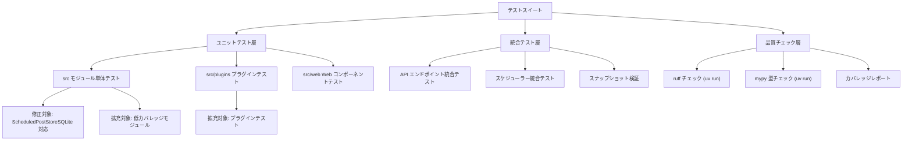

# Technical Design Document

## Overview

このドキュメントでは、Blog AutoPost CLI のテストカバレッジを 49% から 80% 以上に向上させるための技術的な設計を定義します。現在 156 個のテストのうち 124 個が合格し、30 個のエラーと 2 個の失敗が存在する状況を改善します。

**目的**: テスト信頼性の向上、バグ早期発見、安全なリファクタリング基盤の構築

**対象ユーザー**: 開発者、保守者、CI/CD パイプライン

**影響範囲**: 全ソースコード（src/）のテストカバレッジ向上、コード品質向上（ruff/mypy）

### Goals

- 既存テストエラー（30 件）を 0 にクリア
- 全体カバレッジを 49% → 80% 以上に向上
- 主要モジュールのカバレッジを 70% 以上に達成
- ruff による lint 警告を 0 に
- mypy による型エラーを 0 に
- Python 3.12+ の最新慣例に準拠

### Non-Goals

- E2E テストの実装（統合テストは含む）
- パフォーマンステストの開発
- ドキュメント生成の自動化
- 新機能の追加開発

---

## Architecture

### 既存テスト構造の分析

**現在の構成**:
- テストファイル: 23 個（`tests/test_*.py`）
- ソースモジュール: 30+ 個（`src/` 配下）
- テストフレームワーク: pytest + pytest-cov

**既存パターン**:
- ユニットテスト主体（pytest）
- モック化による外部依存の隔離
- フィクスチャの利用

**課題**:
- ScheduledPostStore から ScheduledPostStoreSQLite への移行に伴うテスト未対応
- 低カバレッジモジュール（main.py 25%、article_manager.py 27%）のテスト不足
- エラーハンドリングのテスト不足

### 高レベルアーキテクチャ



### テスト戦略設計

**階層化テスト戦略**:
1. **ユニットテスト** - モジュール単体の動作検証
2. **統合テスト** - モジュール間の連携検証
3. **品質チェック** - コード品質・型安全性

**テスト対象グループ化**:
- **グループ A**: ScheduledPostStore 関連（エラー 30 件の修正）
- **グループ B**: 低カバレッジモジュール（main.py、article_manager.py など）
- **グループ C**: プラグイン群（各 SNS）
- **グループ D**: Web API・スケジューラー

---

## 実装戦略

### Phase 1: テストエラーの修正（優先度: 高）

**対象**: test_scheduled_post_api.py（27 エラー）、test_scheduler_service.py（3 エラー）

**修正アプローチ**:
1. ScheduledPostStoreSQLite の API 確認
2. モック化の更新（file_path 属性削除への対応）
3. テストフィクスチャの書き換え

**実行コマンド**:
```bash
uv run pytest tests/test_scheduled_post_api.py -v
uv run pytest tests/test_scheduler_service.py -v
```

### Phase 2: 失敗テストの修正（優先度: 高）

**対象**: test_article_manager.py::test_force_mark_all_as_posted_writes_to_file、test_web_app.py::test_access_root_unauthenticated

**修正内容**:
- 一時ファイル取り扱いの正規化
- 認証フロー期待値の修正

### Phase 3: 低カバレッジモジュールのテスト拡充（優先度: 中）

**対象モジュール**:
| モジュール | 現在のカバレッジ | 目標 | 追加テスト数（目安） |
|-----------|----------------|------|-------------------|
| src/main.py | 25% | 70% | 20-30 |
| src/article_manager.py | 27% | 70% | 15-20 |
| src/image_resizer.py | 26% | 70% | 15-20 |
| src/web/core_posting_logic.py | 16% | 70% | 20-25 |
| src/web/scheduler_service.py | 35% | 70% | 15-20 |

**テスト項目例**:
- CLI 引数のパース（--dry-run、--debug、--limit など）
- エラーハンドリング、例外ケース
- 境界値テスト、無効入力

### Phase 4: プラグインテスト拡充（優先度: 中）

**対象プラグイン**:
| プラグイン | 現在のカバレッジ | 目標 |
|-----------|----------------|------|
| bluesky.py | 43% | 70% |
| mastodon.py | 40% | 70% |
| misskey.py | 45% | 70% |

### Phase 5: Web API・スケジューラーテスト拡充（優先度: 中）

**対象モジュール**:
| モジュール | 現在のカバレッジ | 目標 |
|-----------|----------------|------|
| src/web/main_web.py | 64% | 80% |
| src/web/scheduled_post_store_sqlite.py | 40% | 80% |
| src/web/posting_service.py | 67% | 80% |

### Phase 6: コード品質向上（ruff/mypy）（優先度: 中）

**実行コマンド**:
```bash
# ruff チェック
uv run ruff check src/ tests/

# ruff 自動整形
uv run ruff format src/ tests/

# mypy 型チェック
uv run mypy src/
```

**修正対象**:
- PEP 8 準拠（インデント、スペース、命名規則）
- 古い Python 構文の現代化（str.format() → f-string など）
- 型ヒント追加（関数シグネチャ）

---

## テスト実装パターン

### ユニットテスト構造

```python
def test_feature_name():
    """テスト目的を簡潔に記述"""
    # Arrange: テストデータ準備
    mock_dependency = Mock()
    
    # Act: テスト対象の処理実行
    result = target_function(mock_dependency)
    
    # Assert: 期待値との検証
    assert result == expected_value
```

### モック化ガイドライン

- 外部 API 呼び出しは必ずモック化
- ファイル I/O は一時ディレクトリで実行
- データベース操作は SQLite in-memory で実行

### テスト命名規則

`test_<関数名>_<条件>_<期待結果>`

例: `test_article_manager_detect_new_articles_returns_three_items`

---

## コンポーネント別テスト設計

### CLI エントリーポイント（main.py）

**テスト対象**:
- コマンドライン引数のパース
- 各実行モード（通常、--dry-run、--debug、--limit）
- エラーハンドリング

### 記事管理（article_manager.py）

**テスト対象**:
- RSS/Atom フィード解析
- 新着記事検出ロジック
- 重複排除メカニズム
- JSON ファイル永続化

### メディア処理（image_resizer.py、media_validator.py）

**テスト対象**:
- 画像リサイズの成功・失敗ケース
- メディアバリデーション（SNS ごとの制限）
- ファイル形式変換

### Web API（src/web/main_web.py）

**テスト対象**:
- 全 HTTP メソッド（GET、POST、PUT、DELETE）
- 認証・認可チェック
- リクエスト/レスポンス検証

---

## エラーハンドリング・テスト戦略

### エラーカテゴリー

| カテゴリー | 例 | テスト方法 |
|-----------|-----|----------|
| API エラー | タイムアウト、レート制限 | Mock で例外発生 |
| バリデーションエラー | 不正な入力 | 無効値をテスト |
| ファイル操作エラー | ファイル未検出 | Mock で IO エラー |
| 型エラー | 型不一致 | mypy で型チェック |

### リカバリーメカニズムの検証

- リトライロジック（最大試行回数、指数バックオフ）
- フォールバック処理
- ロールバック手順

---

## 品質チェック統合

### ruff 設定（pyproject.toml）

```toml
[tool.ruff]
line-length = 100
target-version = "py312"

[tool.ruff.lint]
select = ["E", "F", "W", "I"]
```

### mypy 設定（pyproject.toml）

```toml
[tool.mypy]
python_version = "3.12"
strict = true
warn_unused_ignores = true
```

### CI/CD 統合

```bash
# テスト実行
uv run pytest --cov=src --cov-report=term-missing

# ruff チェック
uv run ruff check src/ tests/

# mypy チェック
uv run mypy src/
```

---

## テストカバレッジ目標

### 段階的目標

| フェーズ | 期間（目安） | 全体目標 | 主要モジュール目標 |
|---------|------------|--------|-----------------|
| Phase 1-2 | 1-2 日 | 52% | 35% |
| Phase 3-4 | 3-5 日 | 65% | 60% |
| Phase 5-6 | 2-3 日 | 80% | 75% |

### 計測方法

```bash
# 全体カバレッジ
uv run pytest --cov=src --cov-report=html

# モジュール別
uv run pytest --cov=src/main --cov=src/article_manager --cov-report=term-missing
```

---

## 実装優先順位

1. **Critical**: テストエラー修正（Phase 1-2）→ ビルド安定性確保
2. **High**: 低カバレッジモジュール拡充（Phase 3） → カバレッジ大幅向上
3. **Medium**: プラグイン・Web API テスト（Phase 4-5） → 機能安定性
4. **Medium**: コード品質向上（Phase 6） → 保守性向上

---

## リスク・課題

| リスク | 対策 |
|-------|------|
| テスト実行時間増加 | モック化によるレイテンシ削減、並列実行 |
| 既存テストの破損 | リグレッション防止、段階的適用 |
| 型チェック厳しすぎて実装が停滞 | mypy strict モードは最後に適用 |
| カバレッジ測定ツールの誤検知 | pytest-cov の exclude 設定で調整 |

---

## Success Criteria

✅ 全テスト合格（エラー・失敗 0）
✅ 全体カバレッジ 80% 以上
✅ 主要モジュール 70% 以上
✅ ruff 警告 0
✅ mypy エラー 0
✅ Python 3.12+ 慣例準拠
