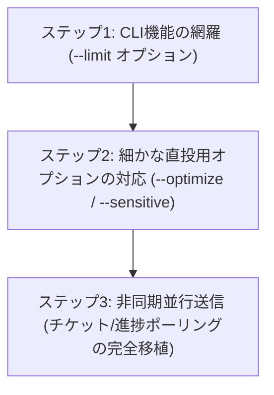

# blog-autopost Python版 vs Rust版 機能差異分析レポート

Python版リポジトリのソースコードを徹底的に調査し、現在のRust版（`blog-autopost-rs`）に実装されている機能と、不足している機能（差異）をまとめました。

---

## 1. コマンドライン（CLI）機能の比較

Python版のCLIオプション・サブコマンドに対する、現在のRust版の対応状況です。

| 機能 / オプション | Python版仕様 | Rust版の対応状況 |
| :--- | :--- | :--- |
| **`--config`** | 設定ファイルのパス指定 (デフォルト: `config.yml`) | **実装済み** (Cli構造体のグローバル引数) |
| **`--dry-run`** | 投稿や保存をせずシミュレーションする | **実装済み** (`Commands::Run`内の引数として動作) |
| **`--limit <num>`** | **新着記事 of チェック時に処理する記事数を制限** | **未実装** (新着記事がすべて処理されます) |
| **`--debug`** | 詳細なデバッグログを表示 | **未実装** (現在は一時的なprintlnで代用) |
| **`--feed <names>`** | 処理するフィードをカンマ区切りで限定 | **未実装** (最初の1つのフィードのみを自動処理) |
| **`--text <str>`** (直接投稿) | 指定したテキストをSNSへ即時送信する | **実装済み** (`Commands::Post` サブコマンド) |
| **`--sns <names>`** (直投用) | 送信先のSNSをカンマ区切りで限定 | **実装済み** (`Commands::Post`の `--sns` オプション) |
| **`--optimize`** (直投用) | 直接投稿時にもURL短縮やテキスト整形を適用 | **未実装** (Rust版の直接投稿は入力テキストがそのまま送信されます) |
| **`--media <paths>`** (直投用)| ローカルの画像ファイルを添付する（複数指定可） | **実装済み** (手動投稿時の画像・メディア添付に対応) |
| **`--sensitive`** (直投用) | Misskey等の投稿メディアをNSFW（センシティブ）にマーク | **未実装** |
| **`--list-sns`** | 設定されているSNSアカウント名の一覧を表示 | **実装済み** (Cli構造体のオプション引数 `--list-sns`) |
| **`--list-feeds`** | 設定されているフィードの一覧を表示 | **実装済み** (Cli構造体のオプション引数 `--list-feeds`) |
| **`touch-rss-posted`** | フィードの新着をすべて「投稿済み（既読）」にする | **実装済み** (`Commands::Touch` サブコマンドとして移植完了) |

---

## 2. Web UI 機能の比較

Web UIとAPIサーバーまわりにおける、フロントエンド・バックエンドの差異です。

| 機能 | Python版仕様 | Rust版の対応状況 |
| :--- | :--- | :--- |
| **スケジュール登録・管理** | スロット自動計算予約、カスタム日付予約、一覧表示、編集、個別削除、一括クリーンアップ | **移植完了** (今回の実装で全て対応済み) |
| **画像アップロード** | **ドラッグ＆ドロップ、ペースト（コピペ）、ファイル参照でのローカル画像アップロード** | **移植完了** (API `/api/upload` による画像・メディアアップロードに対応、UIでのプレビューや削除操作も完備) |
| **並行送信＆進捗（チケット）** | 複数SNSへの即時送信時にチケットIDを発行し、非同期で進捗（成功/失敗）をポーリング監視・表示 | **簡易実装** (Rust版はAPIリクエスト内で同期ループにて順次送信し結果を返却) |
| **アクセス制限 (CSRF/セッション)** | FastAPIミドルウェアによるCSRF対策とセッション管理 | **移植完了** (Cookieセッション管理および bcrypt ハッシュでのパスワード照合、平文からハッシュへの自動移行に対応) |

---

## 3. 画像処理・最適化（重要機能）の比較

Python版の `image_resizer.py` に実装されている画像最適化ロジックは、SNSの投稿エラーを防ぐために非常に重要な役割を果たしています。

### Python版の仕様 (`image_resizer.py`):
1. **SNS別の制限検出**:
   - **Bluesky**: 1MB以下, 2000x2000px以下
   - **X**: 5MB以下, 4096x4096px以下
   - **Mastodon**: 10MB以下, 1920x1920px以下
   - **Misskey**: 10MB以下, 2048x2048px以下
2. **アスペクト比を維持したリサイズ**:
   - 制限pxを超える場合、`thumbnail`処理（LANCZOSフィルタ）で自動縮小。
3. **段階的品質圧縮**:
   - リサイズしてもファイルサイズ制限を超える場合、品質（quality 85から段階的に30まで）を落として自動圧縮。
4. **追加の再リサイズ**:
   - 品質を最低にしてもサイズオーバーする場合、さらにスケール（0.9倍ずつ）を縮小させて再圧縮を繰り返し、**確実に制限内に収める**。

### Rust版の対応状況:
- **移植完了**。`src/image_resizer.rs` にて image クレートを用いた自動リサイズおよび段階的品質・スケール圧縮ロジック（LANCZOS縮小とJPEG圧縮）が実装され、画像投稿時に自動的に適用されます。

---

## 4. 今後の移行おすすめプラン

本家Python版の機能を徹底的に網羅し、より使いやすいRust製ツールにするためのステップ案です。

### おすすめの優先順位:
1. **`--limit` オプションの実装**: RSS自動投稿の基本機能として、動作テスト時に過去の記事が大量に再投稿されるのを防ぐために非常に有効です。
2. **非同期並行送信（ポーリング）の完全移植**: 複数SNSへの同時送信時にユーザーを待たせず、バックグラウンドでの送信進捗をダッシュボード上で細かく確認できるようにします。
